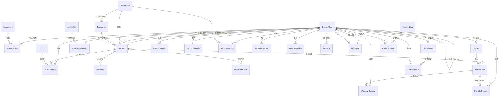
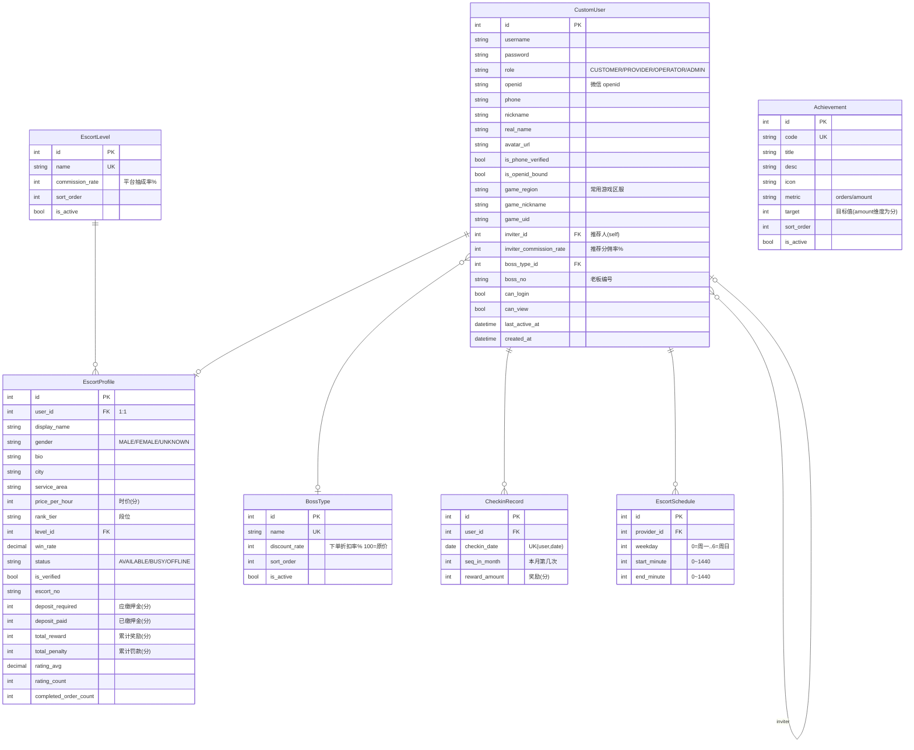
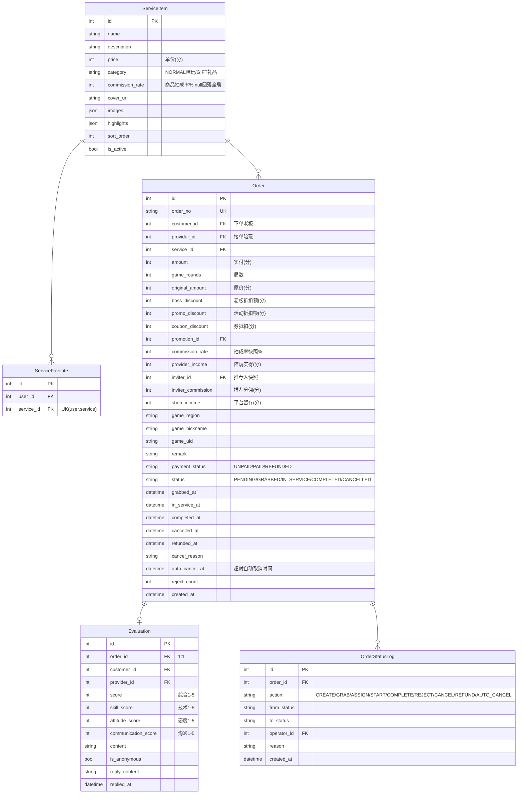
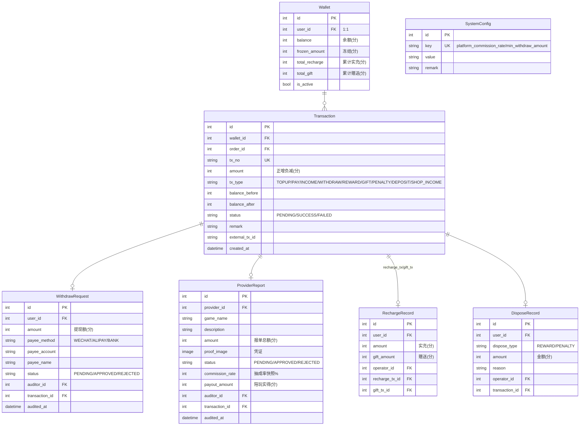
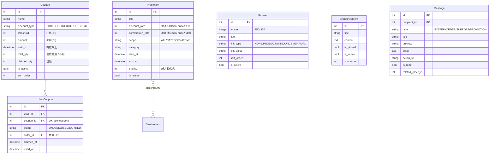
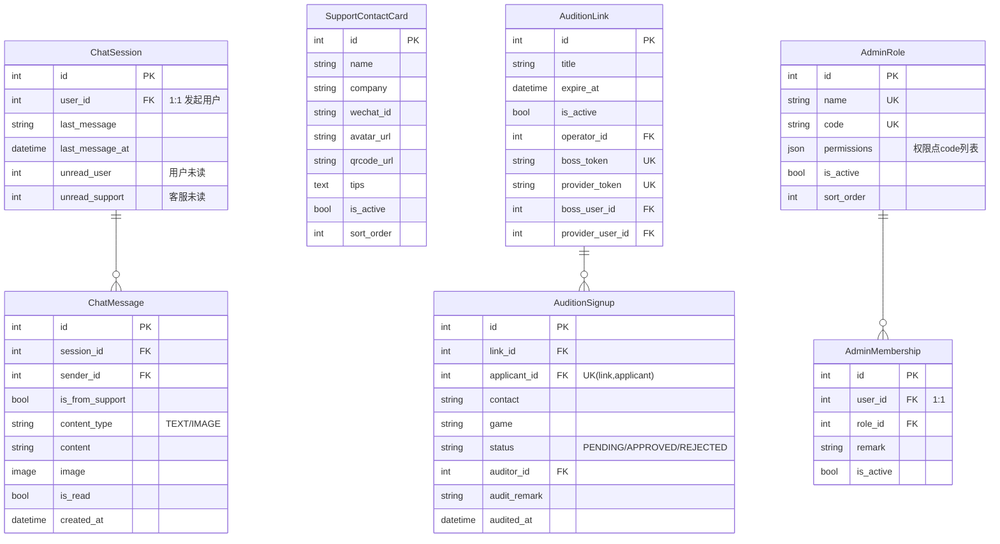

# 兴安电竞（XA）· 数据模型 ER 图

> 配套文档：[PRD.md](./PRD.md) / [DATABASE_DESIGN.md](./DATABASE_DESIGN.md)　│　最后更新：2026-07-30
>
> 本文用 Mermaid `erDiagram` 描述系统数据表及其关系。金额字段使用整数内部账务单位，
> 当前换算规则为 `10` 个内部单位等于 `1` 兴安币。
> GitHub / 支持 Mermaid 的 Markdown 预览器可直接渲染。

---

## 1. 总览：实体关系全景

---

## 2. 用户与陪玩域（users）

> 说明：`Achievement` 为成就配置表，老板的解锁状态按其已完成订单数/累计消费实时计算，不单独落用户成就记录。

---

## 3. 订单与服务域（orders）

---

## 4. 钱包与资金域（wallet）

---

## 5. 营销与内容域（coupons / promotions / banners / announcements / site_messages）

---

## 6. 客服 / 试音 / 后台权限域（chat / support / audition / console）

---

## 关系要点速记

| 关系 | 说明 |
|------|------|
| CustomUser ↔ EscortProfile | 一对一；仅陪玩角色拥有 |
| CustomUser ↔ Wallet | 一对一；首次访问自动创建（含平台系统账户） |
| CustomUser ↔ CustomUser (inviter) | 自关联；推荐人体系 |
| Order ↔ Evaluation | 一对一；订单完成后可评价一次 |
| Order → ServiceItem / Promotion | 多对一；下单时落库快照字段，历史不随源数据变更 |
| Transaction ↔ WithdrawRequest / ProviderReport / RechargeRecord / DisposeRecord | 资金动作各自挂关联流水，保证可追溯 |
| Promotion ↔ ServiceItem | 多对多；仅 `scope=ITEMS` 时使用 |
| ChatSession ↔ CustomUser | 一对一；非客服用户与客服团队共享会话池 |
| AdminRole ↔ AdminMembership ↔ CustomUser | RBAC：角色持权限点，用户绑角色 |
</content>
