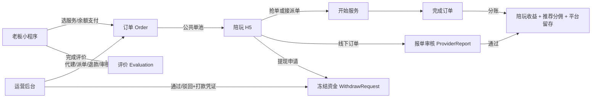

# 兴安电竞（XA）游戏陪玩平台 · 产品规格文档（订单管理与陪玩结算专项）

> 文档版本：v2.0　│　文档性质：**专项产品规格（PRD）**　│　最后更新：2026-08-03
>
> 编制依据：`docs/PRD.md`（现状梳理 v1.0）、`docs/PRODUCT_DOCUMENTATION.md`（代码现状版 v1.0）、`docs/DATABASE_DESIGN.md`、`docs/API.md`、`docs/ARCHITECTURE.md`、`README.md`。
>
> 说明：本文在完整记录系统**现有全部软件功能**（作为需求基线）的基础上，**专项深化游戏陪玩订单管理**与**陪玩后端报单/提现结算体系**两大主线，并将其中的实现缺口整理为本期专项新需求。金额在服务端一律以「分」为内部单位，前端展示为「元」。

---

## 1. 背景与目标（Why）

### 1.1 业务背景
兴安电竞（XA）是一套面向**游戏陪玩俱乐部**的单仓多端 SaaS 系统，覆盖「老板（下单方）下单 → 陪玩（接单方）抢单/履约 → 客服（运营）派单与结算」的完整业务闭环，并附带钱包资金、营销、客服 IM、招募试音、签到与打赏等能力。

系统的价值核心在于**订单履约**与**陪玩收益结算**两条资金主线。当前代码已实现主链路，但在订单履约的精细化（预约/冲突/争议/对账）与陪玩结算的闭环（报单业务归属、提现打款凭证、押金退押、渠道对接）上仍存在边界缺口，影响运营效率、财务对账与合规。

### 1.2 本期专项目标
1. **统一订单管理心智模型**：把分散在三端（老板小程序 / 陪玩 H5 / 后台）的订单能力收敛到一套清晰的状态机、生命周期与操作权限之上，明确每一态的可执行动作与审计留痕。
2. **补全陪玩结算闭环**：把"报单申报 → 抽成入账"与"提现申请 → 审核 → 打款凭证 → 到账"做成可追溯、可对账、可合规的完整资金链路，消除"只点通过但无打款凭证/无法对账"的盲区。
3. **暴露并收敛已知风险**：对双陪结算基数、押金退押、报单业务归属、自动取消兜底等问题给出产品规则与优先级。

### 1.3 非目标（Non-goals，本期不做）
- **不**在本期接入微信/支付宝真实支付下单与支付回调（老板充值仍以后台人工入账为主，列为 P0 待定项，详见 §11）。
- **不**在本期对接第三方打款渠道 API（微信/支付宝/银行代发）与自动对账；本期只把"打款凭证/流水号/打款时间/税额"做成强制字段与追溯能力。
- **不**新增"语音卡在线录制/试听/单独审核"能力（属试音模块独立专项）。
- **不**重构账户域（`CustomUser`↔`ClubAccount` 迁移属底层演进，不在本期产品范围）。
- **不**向老板小程序开放双陪自助下单（P1，本期仅后台代建，规则待确认）。

---

## 2. 角色与权限

| 角色 | C 端 role | 后端 Role | 在订单/结算中的职责 |
|------|-----------|-----------|---------------------|
| 老板 | `customer` | `CUSTOMER` | 下单支付、取消待接单、评价、发起/查看自己的报单关联（无）、查看钱包流水 |
| 陪玩（大神/打手） | `provider` | `PROVIDER` | 抢单/派单、履约、报单、申请提现、缴押金、维护资料与档期 |
| 客服（运营） | `support` | `OPERATOR` | 派单、代建单、退款、审核报单、审核提现、调账、内容运营 |
| 平台管理员 | — | `ADMIN` | 后台全功能（RBAC 权限点控制） |
| 平台系统账户 | — | `__platform__`（不可登录） | 归集订单平台留存收入 `shop_income` |

权限模型：后台 RBAC，角色持有权限点集合（如 `order:view`、`order:dispatch`、`report:audit`、`withdraw:audit`）。路由守卫校验 `meta.perm`，页面内 `auth.hasPerm()` 控制按钮级权限；超管 `is_superuser` 放行全部。

---

## 3. 术语与口径

- **兴安币与分**：内部账务单位统一为「分」（整数，禁止浮点）。`10 分 = 1 兴安币`，`10 兴安币 = 1 元`。展示层除以 100 得元。签到门槛 188 元/388 元即 1,880/3,880 兴安币。
  > ⚠️ 口径冲突：旧 `README.md` 以"兴安币"为对外存储单位；`PRD.md`/`DATABASE_DESIGN.md` 以"分"为内部单位，二者换算一致（1 兴安币 = 10 分）。本期统一以**分**为唯一存储口径，对外展示统一换算为元。
- **报单（ProviderReport）**：登记"**平台外已完成订单**"的收益申报，**不是**标准订单补录。审核通过后按抽成率把实得计入陪玩钱包。
- **提现（WithdrawRequest）**：陪玩把钱包可用余额提现到微信/支付宝/银行卡，走"冻结 → 审核 → 打款/驳回"两阶段。
- **双陪（Dual-provider）**：一个订单由两名陪玩共同履约，后台代建/派单，分开结算。
- **通行证（Pass）**：陪玩按日购买的抢单优先级凭证，决定公共订单进入个人单池的延迟时间。

---

## 4. 全局业务总览



---

## 5. 现有功能全景（需求基线）

> 本节完整记录系统当前已实现的功能，作为本期专项的需求基线。**加粗**项为本 PRD 的专项深化对象。

### 5.1 老板端（微信小程序 · 不支持 H5）

> **交付形态决策**：老板端仅以微信小程序交付，不提供 H5 版本；未来以微信小程序形式上架。仓库历史保留的 `boss:build:h5` 构建脚本按本期决策标记为**弃用**，不再作为交付通道。微信快捷登录（`openid`）为唯一登录方式。

- 微信快捷登录（openid 匹配/绑定/新建），可维护昵称、手机、常用游戏资料。
- 首页：Banner 轮播、搜索、服务入口、公告、陪玩推荐与榜单、营销入口。
- 服务与陪玩选择：服务商品（含礼物类标记）、陪玩列表（评分/段位/时价/胜率/认证）、指定或不指定陪玩。
- **下单与余额支付**：结算提交服务/局数/指定陪玩/优惠券/游戏资料/备注；服务端计算 `实付 = 原价×局数 − 老板折扣 − 活动折扣 − 券抵扣`，同一事务内扣款、建单、写流水、核销券、写日志。
- **老板订单**：按状态列表、取消待接单（退余额）、查看详情、`已完成未评价` 评价一次。
- 评价：综合 1–5 分 + 技术/态度/沟通三维，支持文字与匿名；更新陪玩评分；陪玩可回复。
- 钱包、月度签到（阶梯奖励）、优惠券（领券/券包）、成就馆（实时解锁）、收藏。
- 消息中心（系统/订单/客服/活动）、客服 IM（文字/图片）、客服名片。

### 5.2 陪玩端（H5 / Web）
- 账号密码登录（PROVIDER，后台开户后直接登录；~~需 `bindCode`~~ **绑定码机制已废弃**），WebSocket 实时接单。
- **接单工作台**：今日单量/服务中/完成率/累计收益；待接单池（抢/拒）、已接单（拒/开始）、服务中（完成）、已完成（查看）。
- **抢单通行证**：黑/金/银/铜/无卡，日价 50/30/10/2 元 / —，对应公共订单延迟 立即/30s/60s/120s/300s；钱包余额日购，有效期 1 天。
- **履约状态机**（见 §6.1）。
- **报单**（见 §7.1）。
- **钱包与提现**（见 §7.2）。
- 押金（余额补缴差额，无退押）、个人资料与每周档期（四段制）、试音报名（后台菜单"声卡管理"）。

### 5.3 运营后台（Web）
- 工作台/数据看板：平台概览（用户/订单/金额 KPI、状态分布、最近订单）、陪玩概览（接单额/量、游戏/礼物与性别、押金/奖罚/钱包、Top10）。
- **派单管理**（见 §6.3）。
- 老板管理（账号/分级/钱包充值/调账）、陪玩管理（资料/等级/押金/奖惩/审核入口）。
- 商品/营销/内容（服务商品、促销、优惠券、成就、Banner、公告、客服名片、站内消息）。
- 客服工作台、试音审核、财务与审核（流水、报单审核、提现审核、抽成率/最低提现额配置）。
- RBAC 角色权限、后台账号管理。

### 5.4 服务端能力
- Django + DRF + Channels（WebSocket）+ Celery：REST API、JWT 登录、订单实时推送、待接单超时自动取消、钱包与结算。
- 接口前缀：`/api`（C 端）、`/api/admin`（后台）、`/media`（媒体）。WebSocket：`ws://<host>/api/ws/orders/?token=<JWT>`。
- 不可跨越规则：金额以分存储；状态变更走 `orders.state_machine.transition`；钱包变更必写 `Transaction` 且事务+行锁；前端不复刻计价结算。

---

## 6. 专题一：游戏陪玩订单管理

### 6.1 订单状态机（权威定义）
```
PENDING(待接单) ──grab/assign──▶ GRABBED(已接单) ──start──▶ IN_SERVICE(服务中) ──complete──▶ COMPLETED(已完成)
     │                               │                            │                            │
     ├─cancel(老板)──────────────────┤                            │                            │
     ├─auto_cancel(超时30min)─────────┤                            │                            │
     └─assign(客服派单,未指定陪玩时)──┘                            │                            │
                                     GRABBED ──reject──▶ PENDING(reject_count+1)
                                     GRABBED/IN_SERVICE ──refund(客服)──▶ CANCELLED(已取消)
COMPLETED / CANCELLED 为终态，不可再流转。
```
- 每次状态变更写入 `OrderStatusLog`（动作、前后状态、操作人、原因、时间）。
- 并发抢单由服务端事务 + 状态机保证仅一人成功；成功后陪玩变 BUSY，完成恢复 AVAILABLE。
- **指定陪玩订单**：扣款成功后立即进 GRABBED 并锁定该陪玩；**未指定陪玩订单**才进公共待接池与超时队列。

### 6.2 计价与拆账（下单时落库快照）
```
实付 amount = original_amount(单价×局数) − boss_discount − promo_discount − coupon_discount
分账：provider_income + inviter_commission + shop_income = amount
```
- 抽成率优先级：**促销活动 > 陪玩等级 > 商品抽成 > 全局**（默认 `PLATFORM_COMMISSION_RATE=20%`）。
- 折扣型促销与优惠券互斥；券需未用/未过期/满足门槛；余额不足不建单。
- 标准单分账：`平台抽成池 = 实付×抽成率`；`推荐分佣 = 抽成池×老板推荐分佣率`；`平台留存 = 抽成池 − 推荐分佣`；`陪玩实得 = 实付 − 抽成池`。下单固化，**完成时**才实际入钱包。

### 6.3 双陪结算规则（已落地 · 资金守恒）
- 双陪为后台代建/派单能力；订单实付先**平均分配**为每名打手的结算基数（余数给靠前打手），`sum(结算基数) == 实付`；每名打手再按**自己的**百分比/固定抽成从各自基数算实得。订单级推荐分佣与平台留存只入一份。
- 结算入账前经 `assert_order_conserved` 跨行闸门校验：任一打手实得之和超过订单实付即整笔回滚，杜绝"双陪各拿全额"导致的超付。
- 状态：**规则已落地**（原"实得和可能 > 实付"的开放问题已按"均分基数 + 各自抽成"方案解决，详见《系统逻辑排查报告》P0-1 与 `orders/settlement.py` 的 `build_provider_shares` / `aggregate_order_split` / `assert_order_conserved`，并配回归测试 `test_double_provider_equal_base_different_rate_conserved`）。

### 6.4 评价与争议
- 评价仅由订单老板在 COMPLETED 后提交一次，含三维评分；匿名可调；陪玩/后台可回复；后台可删除（回退评分聚合）。
- 退款：已支付且 GRABBED/IN_SERVICE 可由客服 `refund`（原因必填），支付状态转 REFUNDED，退余额并写独立 REFUND 流水。
- 争议/客诉当前通过客服 IM 与后台退款闭环，无独立"仲裁单"实体。

### 6.5 后台订单管理功能
- 筛选（订单号/老板/陪玩/状态/支付状态）、详情与状态日志、取消、退款、快捷派单。
- 代建订单：选老板/商品/局数/单陪或双陪/陪玩/抽成方式/游戏资料/备注；单陪可不指定（进公共池），双陪须两名不同陪玩；每名打手独立 `OrderProvider` 结算快照。
- 权限点：`order:view / order:dispatch / order:refund / order:cancel`。

### 6.6 本期订单管理新需求
| 编号 | 需求 | 用户故事 | 优先级 |
|------|------|----------|--------|
| ORD-1 | **预约服务时间/预计时长** | 作为运营，我希望订单带预约开始时间与预计时长，以便做档期冲突检测与履约提醒 | P1 |
| ORD-2 | **档期冲突检测** | 作为系统，我希望已配置档期的陪玩在被派/抢单时校验时段不跨单冲突，以免超量接单 | P1 |
| ORD-3 | **自动取消兜底补偿** | 作为运维，我希望有定时补偿扫描 + 超时告警，以免 Celery/Redis 异常导致长期待接单 | ✅ 已实现 |
| ORD-4 | **封禁/风控记录** | 作为风控，我希望账号封禁带原因/期限/操作审计，而非仅登录/查看开关 | P2 |
| ORD-5 | **退款单号与渠道状态** | 作为财务，我希望退款带单号与渠道退款状态，以便对账 | P2 |
| ORD-6 | **订单业务归属字段**（与报单对齐） | 作为分析，我希望订单可关联游戏/商品/时长维度和老板来源，便于经营分析 | P2 |

> 状态说明：ORD-3 自动取消兜底**已于本期实现**——`orders/tasks.py::check_pending_timeouts`（幂等补偿扫描）+ Celery beat 注册 + `check_order_timeout` 管理命令（cron 兜底）三重保障，原 P2 优先级作废。其余 ORD 仍为待办 backlog。

---

## 7. 专题二：陪玩后端报单与提现（结算体系）

### 7.1 报单模块（ProviderReport）
**现有能力**
- 陪玩登记平台外已完成订单：填游戏名称、实际收款金额、订单说明，上传**一张**凭证图。
- 提交后 `PENDING`；可查看待审核/已通过/已驳回及审核备注。
- 后台审核通过：固化抽成率，按报单金额扣平台抽成后实得计入陪玩钱包（`INCOME` 流水）；驳回不发生资金动作；已审核不可重复审。
- 接口：`GET/POST /api/wallet/reports/`（PROVIDER）；后台 `POST reports/<id>/approve|reject/`（权限 `report:audit`）；全局抽成率 `GET/PUT /api/admin/config/commission`。

**本期报单新需求**
| 编号 | 需求 | 用户故事 | 优先级 |
|------|------|----------|--------|
| RPT-1 | **业务归属字段** | 作为运营，我希望报单关联老板/商品/服务时长/游戏，以便经营分析口径完整 | P2 |
| RPT-2 | **凭证必填规则** | 作为财务，我希望按金额分级强制凭证张数与清晰度，降低虚假报单 | P2 |
| RPT-3 | **批量报单/模板** | 作为高频陪玩，我希望批量提交或复用模板，减少重复填写 | P3 |

### 7.2 提现模块（WithdrawRequest）
**现有能力**
- 提现方式：微信/支付宝/银行卡，需填收款账号与真实姓名。
- 约束：金额 ≥ 后台最低提现额（默认 `MIN_WITHDRAW_AMOUNT=10000` 分=100 元）且 ≤ 可用余额。
- 申请：`balance-=amount`、`frozen+=amount`，生成 `WITHDRAW/PENDING` 流水与提现单。
- 后台通过：减冻结、流水 SUCCESS（进入人工打款）；驳回：减冻结并退回余额、流水 FAILED（原因必填）。
- 配置：最低提现额 `GET/PUT /api/admin/config/withdraw`（`withdraw:audit`）。
- 接口：`GET/POST /api/wallet/withdraw/`（PROVIDER / 登录）；后台 `POST withdrawals/<id>/approve|reject/`（`withdraw:audit`）。

**数据库约束（DATABASE_DESIGN）**：提现金额 > 0；税率 0..100；税额 ≤ 申请额；`actual_amount = amount - tax_amount` 由模型与约束同时保证。

**⚠️ 关键边界**：当前代码**只管理申请、冻结、审核状态，未调用真实打款接口，也无打款回单字段**（PRODUCT_DOCUMENTATION §5.5）。已优化项要求审核通过必须填写真实打款流水号/凭证编号并记录打款时间。

**本期提现新需求**
| 编号 | 需求 | 用户故事 | 优先级 |
|------|------|----------|--------|
| WD-1 | **打款凭证强制化** | 作为财务，我必须在审核通过时填写打款流水号/凭证编号/打款时间，否则不能置为成功 | P0（已优化，固化为强制字段） |
| WD-2 | **税额与实到账** | 作为陪玩，我希望看到申请额/税额/实际到账，税率可后台配置 | P1 |
| WD-3 | **打款渠道回执（预对接）** | 作为财务，我希望预留渠道回执字段与状态（成功/失败/挂起），为后续 API 对接铺垫 | P1 |
| WD-4 | **提现明细导出** | 作为财务，我希望按状态/时间导出提现对账单（含税额/实到账/打款凭证） | P2 |
| WD-5 | **失败重试与通知** | 作为陪玩，我希望打款失败能重试并收到状态通知 | P2 |

### 7.3 押金（Deposit）
- 后台配置应缴/已缴；陪玩可用余额补缴差额（生成 `DEPOSIT` 流水）。
- ⚠️ **缺口**：当前**不支持退押**（PRODUCT_DOCUMENTATION §5.6）。
- 新需求 `DP-1`（P2）：退押申请 → 冻结 → 审核 → 打款/驳回，形成陪玩退出闭环。

### 7.4 钱包与资金流水（Wallet / Transaction）
- Wallet：余额/冻结/累计充值/累计赠送，均不可为负。
- Transaction：9 类（`TOPUP/GIFT/PAY/INCOME/WITHDRAW/REWARD/PENALTY/DEPOSIT/SHOP_INCOME`），有符号整数表达增减，记录 `balance_before/after`，不可缺失。
- 并发安全：钱包变更在 `transaction.atomic()` + `select_for_update` 行锁内完成。
- 充值：客服后台为老板充值，可附赠送额（实充 `TOPUP`、赠送 `GIFT`），保存第三方流水号/凭证图/备注/操作人。

---

## 8. 指标体系（Metrics）

### 8.1 北极星指标
- **月度成功履约订单数（Monthly Completed Orders）**：最能代表平台真实交易价值的指标，直接受订单管理效率与陪玩结算体验影响。基线：以 `seed_stage_test_data` 全阶段数据（已完成 40/120 笔）为验收参考，生产需按真实历史月均值设定目标。

### 8.2 驱动指标（Drivers）
| 指标 | 定义 | 目标方向 |
|------|------|----------|
| 订单履约时长 | PENDING→COMPLETED 中位时长 | ↓ 缩短 |
| 自动取消率 | 超时取消数 / 待接单总数 | ↓ 降低（目标 < 8%） |
| 报单审核 SLA | 提交→审核完成中位时长 | ↓ < 24h |
| 提现审核 SLA | 申请→打款凭证完成中位时长 | ↓ < 48h |
| 结算准确率 | 分账/入账与预期一致比例 | = 100% |

### 8.3 健康指标（Guardrails）
| 指标 | 定义 | 警戒线 |
|------|------|--------|
| 退款率 | 退款订单 / 已完成+退款订单 | < 5% |
| 争议/投诉率 | 经客服介入订单占比 | < 3% |
| 提现驳回率 | 驳回提现 / 总提现 | 监控异常波动 |
| 双陪超分账率 | 双陪实得和 > 实付占比 | 待财务确认后设阈值 |

---

## 9. 非功能性需求
- **实时性**：订单状态与客服消息经 WebSocket 秒级推送；断线后 REST 拉取兜底。
- **并发安全**：钱包 `select_for_update` + 事务，防超扣/重复入账/重复抢单。
- **数据一致性**：资金写操作在 `transaction.atomic()` 内；分账守恒在事务结算完成时校验。
- **可配置**：抽成率、最低提现额、税率等运行参数后台动态调整（`SystemConfig`）。
- **合规**：涉及用户真实姓名/收款账号/打款凭证属敏感个人信息，默认按个人信息保护法做加密存储与最小可见（仅财务角色可视全账号，其余脱敏）。
- **可观测**：订单状态日志、资金流水、报单/提现审核动作全程留痕，支持审计与对账。

---

## 10. 风险与开放问题（Risks & Open Questions）

| 优先级 | 风险/缺口 | 影响 | 本期处置 |
|--------|-----------|------|----------|
| P0 | 老板充值无微信支付闭环，依赖人工入账 | 无法纯自助交易闭环 | 列为独立专项，本期不接，需决策是否一期接微信支付 |
| P0 | 提现无真实打款渠道，仅人工+凭证字段 | 财务工作量大、易漏打 | 固化打款凭证强制字段（WD-1）；渠道 API 后续专项 |
| P1 | 双陪结算基数规则可能使实得 > 实付 | 财务模型失真 | **已修复**：改为均分基数 + 各自抽成 + 跨行守恒闸门（P0-1），无需财务签字即可放行 |
| P1 | 订单无预约时间/时长 | 难做排班/冲突/提醒 | 新增 ORD-1/ORD-2 |
| P2 | 报单不关联老板/商品/时长 | 经营分析弱 | RPT-1 |
| P2 | 押金仅缴不退 | 陪玩退出无闭环 | DP-1 |
| 已落地 | 自动取消兜底 | Celery/Redis 异常仍可兜底 | ORD-3 已实现（定时补偿扫描 + Celery beat + `check_order_timeout` cron 命令三重保障），原 P2 风险已消除 |
| P2 | 封禁仅开关无原因/期限/审计 | 风控追溯不足 | ORD-4 |
| 口径 | README"兴安币" vs PRD/DB"分" | 文档歧义 | 统一以"分"为存储口径，展示换算元（§3） |

---

## 11. 验收主链路（Acceptance）
1. 后台建老板等级/陪玩等级/游戏服务分类/服务商品/陪玩账号。
2. 后台给老板充值；老板微信登录并维护游戏资料。
3. 老板选商品+陪玩+局数下单，校验等级折扣/活动/券互斥与余额扣款；验证快照固化。
4. 陪玩抢单与后台派单均成功；并发仅一人抢单；指定陪玩订单直进 GRABBED。
5. 陪玩开始→完成；核对陪玩/推荐人/平台钱包与全部流水（含分账守恒）。
6. 双陪后台代建/完成，核对两名打手分别入账与平台留存唯一。
7. 老板评价，陪玩回复；核对评分聚合。
8. 待接单取消、超时取消、后台退款，核对券/余额/REFUND 流水。
9. 陪玩提交报单（含新业务归属字段 RPT-1），后台通过/驳回并核资金。
10. 陪玩申请提现（微信/支付宝/银行卡），后台**填打款凭证**通过/驳回，核对可用/冻结余额与 `actual_amount`。
11. 试音链接过期/停用、重复报名与审核。
12. 不用角色验证菜单/按钮/API 三层 RBAC（含 `order:* / report:audit / withdraw:audit`）。
13. 断 WebSocket 后 REST 数据仍正确，恢复后实时刷新。

---

## 12. 附录：关键数据对象（订单/结算域）
| 领域 | 对象 | 含义 |
|------|------|------|
| 订单 | `Order`、`OrderProvider`、`OrderStatusLog` | 主单、单/双打手结算明细、审计日志 |
| 口碑 | `Evaluation` | 评价三维分与回复 |
| 资金 | `Wallet`、`Transaction` | 可用/冻结与不可缺失流水 |
| 财务 | `RechargeRecord`、`WithdrawRequest`、`ProviderReport`、`DisposeRecord` | 充值/提现/报单/奖罚 |
| 配置 | `SystemConfig`、`EscortLevel`、`BossType` | 抽成率/最低提现/税率、等级与分级 |

> 字段级定义见 `docs/DATABASE_DESIGN.md` 与 `docs/API.md`；状态机与流程见 `docs/Sequence.md` 与 `docs/ER.md`。
