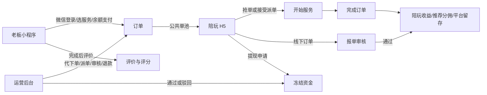

# 兴安电竞游戏陪玩系统产品文档（代码现状版）

> 文档版本：v1.0｜整理日期：2026-07-13｜依据：当前仓库源码反向梳理  
> 适用对象：产品、运营、研发、测试。本文描述“代码当前能做什么”，不等同于未来规划。金额在服务端均以“分”为单位。

## 1. 产品定义

兴安电竞是一套游戏陪玩交易与俱乐部运营系统。系统围绕“老板购买陪玩服务—运营派单或陪玩抢单—陪玩履约—平台结算”的主链路，提供三套独立使用端：

| 使用方 | 产品形态 | 代码目录 | 核心目标 |
| --- | --- | --- | --- |
| 运营/客服/管理员 | Web 管理后台 | `apps/admin-web/` | 管理老板、陪玩、商品、订单、派单、财务、营销、内容与权限 |
| 老板 | 微信小程序（亦可构建 H5） | `apps/boss-miniapp/` | 微信快捷登录、浏览与选择服务/陪玩、下单支付、查单评价和获取售后 |
| 陪玩/打手 | 独立 H5（代码也支持构建微信小程序） | `apps/provider-miniapp/` | 账号登录、抢单/履约/报单、查看收益、申请提现、维护资料与档期 |

统一后端位于 `services/backend/`，提供 REST API、JWT 登录、WebSocket 实时通知、定时取消任务、钱包与结算能力。当前产品不是三个独立业务系统，而是三套前端共享同一套用户、订单和资金数据。

## 2. 产品角色与权限边界

### 2.1 老板（CUSTOMER）

- 可微信登录并自动建立老板账号；可维护昵称、手机及常用游戏资料。
- 可浏览商品、陪玩、评价、排行、公告、优惠券等公开运营内容。
- 可使用钱包余额下单，取消待接订单，对完成订单评价。
- 只能查看自己的订单、钱包、券包、收藏、消息和客服会话。

### 2.2 陪玩（PROVIDER）

- 账号由运营后台创建，使用账号密码登录独立端。
- 可查看公共待接单池；可抢单、拒单、开始服务、完成订单。
- 可编辑对外展示资料和固定档期；认证、等级、价格、押金等由后台维护。
- 可提交线下订单报单、缴纳押金、申请提现、回复评价、报名试音。

### 2.3 运营/客服（OPERATOR）

- 后台账号通过 RBAC 权限点控制菜单和按钮。
- 可代老板建单、指定单陪或双陪、派单、取消、退款、完成结算。
- 可管理老板与陪玩，审核报单、提现、试音，处理客服会话和内容运营。
- 部分 C 端 API 仍保留 OPERATOR 能力，但现行主要操作入口是 Web 管理后台。

### 2.4 管理员（ADMIN/超级管理员）

- 管理后台角色、权限和后台账号。
- 超级管理员绕过普通权限点校验，且其账号受保护。

### 2.5 平台系统账户

系统内置不可登录账户 `__platform__`，用于归集订单的平台留存收入。它不是实际用户端角色。

## 3. 全局业务总览



## 4. 老板微信小程序

底部一级导航为“首页、分类、消息、我的”。需要身份的操作由登录守卫唤起微信登录。

### 4.1 登录与账号

1. 小程序调用微信 `login` 获得 code。
2. 可通过微信手机号授权获得手机号 code，并填写昵称。
3. 后端使用 code 换取 openid；首次访问自动创建 CUSTOMER 用户，后续按 openid 登录。
4. 返回 Access Token、Refresh Token 和用户资料；Access Token 默认 12 小时，Refresh Token 默认 7 天。
5. 后端可通过 `can_login` 禁止账号登录，通过 `can_view` 限制数据查看。
6. 开发环境支持微信 Mock 登录；它不是生产产品能力。

说明：当前老板端的交易支付是“钱包余额支付”，并未实现微信支付商户下单与支付回调。钱包充值主要由后台人工入账。

### 4.2 首页

- Banner 轮播：后台配置图片、排序、启停和跳转类型；支持商品、公告、外链或不跳转。
- 搜索：按昵称、段位、游戏或标签检索陪玩/内容入口。
- 服务入口：进入分类、服务详情、选陪玩及结算。
- 公告：展示启用公告，支持置顶和详情。
- 陪玩推荐与榜单：支持消费榜、接单榜等排行数据。
- 营销入口：优惠券、签到、成就、收藏等。

### 4.3 服务与陪玩选择

- 服务商品包含名称、简介、价格、游戏分类、服务分类、封面、图集、卖点、排序和上下架状态。
- 服务分类可标记“礼物类”，用于运营看板区分游戏单与礼物单。
- 服务详情展示销量（已完成订单数）、评价和收藏状态。
- 老板可查看陪玩展示名、性别、头像、简介、城市、擅长项目、时价、段位、胜率、等级、认证、评分和完成单数。
- 可直接选择某一陪玩下单，也可不指定陪玩，让订单进入公共待接单池或等待客服派单。

### 4.4 下单与余额支付

老板在结算页提交：服务、局数、指定陪玩（可选）、优惠券（可选）、游戏大区、游戏昵称、游戏 UID 和备注。

服务端按以下顺序计算：

```text
原价 = 商品单价 × 局数
实付 = 原价 - 老板等级折扣 - 活动折扣 - 优惠券抵扣
```

- 老板等级折扣由后台配置，100% 为原价。
- 当前有效促销按时间、适用范围和优先级选取一条。
- 折扣型促销与优惠券互斥；优惠券需未使用、未过期且满足门槛。
- 钱包余额不足则不创建订单。
- 成功后在同一数据库事务中扣款、生成订单、写支付流水、核销优惠券并写订单日志。
- 新单默认为已支付、待接单，并设置自动取消时间；任务队列到期后自动取消并退款。
- 指定陪玩的订单会在扣款成功后立即进入“已接单”，锁定该陪玩并向其发送订单消息；未指定陪玩的订单才进入公共待接单池和超时取消队列。
- 下单时固化商品名、单价、手机、游戏资料、折扣、抽成和分账快照，后续配置变化不影响历史单。

### 4.5 老板订单

- 按订单状态查看列表：待接单、已接单、服务中、已完成、已取消。
- 待接单订单可主动取消；已扣金额退回钱包。
- 可查看订单编号、服务、局数、游戏资料、陪玩、金额、状态和时间。
- 已完成且未评价的订单可评价一次。

### 4.6 评价

- 综合分 1–5 分，并支持技术、服务态度、沟通三个维度。
- 支持文字评价和匿名展示。
- 一笔订单仅能评价一次，且必须由订单老板在完成后提交。
- 评价会更新陪玩的平均评分与评价数；陪玩可回复，后台也可代回复或删除。

### 4.7 钱包、签到、优惠券与成就

- 钱包展示余额及资金流水。
- 签到按自然月记录每日唯一签到，并根据“本月第几次签到”的阶梯发放余额奖励。
- 优惠券支持满减、无门槛、有效期、总库存和每人每券限领一次。
- 我的券包按未使用、已使用、已过期展示。
- 成就按已完成订单数或累计消费额实时计算是否解锁。
- 收藏支持对服务商品收藏/取消收藏。

### 4.8 消息与客服

- 站内消息分系统、订单、客服和活动类型，支持单条已读、全部已读和未读数。
- 每个普通用户对应一个客服会话，可发送文字或图片。
- WebSocket 推送新消息和订单状态变化，断线后仍可通过 REST 拉取历史记录。
- 客服名片由后台维护，可展示客服名称、微信号、二维码和提示语。

## 5. 陪玩 H5 端

底部一级导航为“接单、报单、钱包、我的”。代码基于 Taro，可构建 H5 或微信小程序；按当前产品定位应以 H5 发布。

### 5.1 登录与开户

- 陪玩使用客服/运营创建的账号密码登录，不走老板微信快捷登录。
- 后端要求登录用户角色为 PROVIDER，并检查账号是否允许登录。
- 登录后建立 WebSocket 连接，接收订单实时变化。
- 运营后台创建陪玩时同时维护基础资料、认证、等级、价格及押金等。

### 5.2 接单工作台

顶部统计包含今日单量、服务中数量、完成率和累计收益。订单分为：

| 页签 | 数据范围 | 可操作动作 |
| --- | --- | --- |
| 待接单池 | 未指定陪玩且仍待接单的公共订单 | 拒单、抢单 |
| 已接单 | 已由本人抢到或被派给本人 | 拒单、开始服务 |
| 服务中 | 本人正在服务的订单 | 完成订单 |
| 已完成 | 本人历史完成订单 | 查看 |

抢单需要陪玩当前为可接单状态；成功后陪玩状态变为忙碌。并发抢单由服务端事务和状态机保证只能一人成功。

公共订单采用通行证分级开放：黑卡发布即见、金卡 30 秒后、银卡 60 秒后、铜卡 2 分钟后、无通行证 5 分钟后。服务端同时校验列表可见与抢单动作，不能通过直接请求绕过等待时间。

### 5.2.1 抢单通行证

| 通行证 | 每日价格 | 公共订单开放时间 |
| --- | ---: | --- |
| 黑卡 | 50 元 | 立即 |
| 金卡 | 30 元 | 30 秒后 |
| 银卡 | 10 元 | 60 秒后 |
| 铜卡 | 2 元 | 2 分钟后 |
| 无卡 | — | 5 分钟后 |

- 陪玩在接单页面使用钱包余额自行每日采购，每次有效期 1 天。
- 按对应日价原价扣费，购买时生成通行证专用资金流水。
- 有效期内允许续费同等级，续费从原到期时间顺延；不同等级需等待当前通行证到期后购买。
- 通行证只决定订单进入个人单池的时间，不锁单也不保证抢单成功。

### 5.3 履约状态机

```text
待接单 PENDING
  ├─ 抢单/后台派单 → 已接单 GRABBED
  └─ 老板取消/超时取消 → 已取消 CANCELLED

已接单 GRABBED
  ├─ 开始服务 → 服务中 IN_SERVICE
  ├─ 陪玩拒单 → 待接单 PENDING
  └─ 后台退款 → 已取消 CANCELLED

服务中 IN_SERVICE
  ├─ 完成 → 已完成 COMPLETED
  └─ 后台退款 → 已取消 CANCELLED
```

- 完成和取消是终态，不允许再次流转。
- 每次变化记录操作、前后状态、操作人、原因和时间。
- 陪玩端可自行完成订单；后台亦可完成并触发结算。
- 拒单会记录原因、累计拒单次数，并将单重新放回待接池。
- 双陪订单对两名打手均可见且实时同步状态，由主打手统一推进开始/完成，完成时系统按两条打手结算明细分别入账，避免重复履约和重复结算。

### 5.4 报单

报单用于登记“平台外已完成的订单”，不是补建一笔标准订单。

- 填写游戏名称、实际收款金额、订单说明，可上传一张凭证图。
- 提交后状态为待审核；可查看待审核、已通过、已驳回及审核备注。
- 后台审核通过时固化抽成率，按报单金额扣除平台抽成后把实得计入陪玩钱包。
- 审核驳回不发生资金动作；已审核记录不可重复审核。

### 5.5 钱包与提现

- 展示可用余额、冻结金额、收益和流水。
- 提现支持微信、支付宝、银行卡，需填写收款账号和真实姓名。
- 金额不得低于后台配置的最低提现额，也不得超过可用余额。
- 申请时可用余额减少、冻结金额增加，并产生处理中流水。
- 后台通过：减少冻结金额，流水成功，表示进入/完成人工打款流程。
- 后台驳回：减少冻结金额并退回可用余额，流水失败。

重要边界：当前代码只管理申请、冻结和审核状态，没有调用微信、支付宝或银行真实打款接口，也没有打款回单字段。

### 5.6 押金

- 后台配置陪玩应缴押金和已缴押金。
- 陪玩可用钱包余额补缴差额；扣款后生成押金流水。
- 当前没有押金退款申请和后台退押流程。

### 5.7 个人资料与档期

- 陪玩可编辑展示昵称、性别、城市、擅长项目、个人简介。
- 可按周一至周日设置循环档期，每日固定四个 6 小时时段。
- 认证、等级、时价、编号、胜率、押金和奖罚由后台管理。
- 数据模型已包含陪玩头像、介绍视频、查外挂依据图，但当前陪玩资料页没有这些文件的上传入口。

### 5.8 试音报名（后台菜单当前命名“声卡管理”）

- 运营创建试音活动，得到老板入口和陪玩入口两条带随机 token 的分享链接。
- 链接可设置截止时间、启停状态，并绑定老板/陪玩用户。
- 陪玩入口换取登录态后，可填写联系方式、擅长游戏、段位/档期等补充说明并报名。
- 同一用户对同一活动只能报名一次；后台通过或驳回。

重要边界：当前实现是“试音链接 + 文字报名 + 审核”，没有录制、上传、播放或管理语音卡/音频文件的字段与接口。因此若产品要求陪玩填写“语音卡”，该能力尚未实现。

## 6. 运营管理后台

### 6.1 概览

- 平台概览：用户、老板、陪玩、订单量，今日订单，订单总额/实付额，订单状态分布和最近订单。
- 陪玩概览：按日期看接单额、接单量、陪玩收入，区分游戏/礼物和性别，展示押金、奖罚、钱包等指标及 Top10。

### 6.2 派单管理

- 按订单号、老板账号/昵称/手机号、订单状态、支付状态等筛选。
- 查看订单详情与完整状态日志。
- 后台代建订单：选择老板、商品、局数、单陪/双陪、陪玩、抽成方式、游戏资料和备注。
- 单陪可不选陪玩，使订单进入公共池；双陪必须选择两名不同陪玩。
- 每个打手支持百分比抽成或固定金额抽成，并在 `OrderProvider` 中保存独立结算快照。
- 可对现有待接单执行快捷派单，可取消待接订单、退款非终态订单、完成服务中订单。
- 双陪订单后台完成时逐个给打手结算；订单级推荐分佣和平台留存只入账一份。

### 6.3 老板管理

- 查询和编辑老板账号、昵称、手机号、角色、老板类型、人员编号、推荐人、推荐分佣率、登录/查看开关。
- 老板类型配置名称、折扣率、排序、备注和启停。
- 钱包管理可查看余额、冻结额、累计实充/赠送，并执行充值、赠送和人工调账。
- 账目记录保存实充、赠送、第三方流水号、凭证图、备注和操作人。

### 6.4 陪玩管理

- 新建陪玩登录账号和基础资料。
- 维护展示名、性别、头像、介绍视频、查外挂图、城市、擅长范围、时价、段位、胜率、等级、认证、状态和押金。
- 陪玩等级配置平台抽成率、排序、备注和启停；等级不会自动升级。
- 可对陪玩奖励或罚款，直接影响钱包并生成可追溯流水。
- 查看奖惩记录、报单审核、提现审核、试音链接与试音报名。

### 6.5 商品、营销与内容

- 游戏分类、服务分类和服务商品 CRUD；商品支持图集、卖点、排序、上下架和商品级抽成。
- 促销支持全场/指定分类/指定商品，配置老板折扣率、抽成覆盖率、时间窗和优先级。
- 优惠券支持满减/无门槛、门槛、面额、有效期、库存、排序和启停。
- 成就配置支持订单数/消费额两类指标。
- Banner、公告、客服名片和站内消息运营。
- 站内消息可定向发送或全员广播。

### 6.6 客服工作台

- 会话列表支持按用户检索、查看历史消息和未读状态。
- 客服可发送文字或图片，标记会话已读。
- 消息通过 WebSocket 实时到达老板端。

### 6.7 财务与审核

- 查看全平台交易流水，按流水号、账号和类型筛选。
- 报单审核：通过后自动计算并入账；驳回需记录原因。
- 提现审核：通过扣冻结额，驳回退回余额。
- 运行时可配置全局平台抽成率和最低提现金额。

### 6.8 RBAC 权限系统

- 后台角色持有权限点集合，覆盖菜单访问和查看、新建、编辑、删除、派单、审核、退款等按钮动作。
- 路由守卫首先验证登录，再验证页面权限；API 端再次验证动作权限。
- 可新增/编辑后台账号并分配角色；超级管理员拥有全部权限。

## 7. 订单计价、抽成和结算

### 7.1 抽成来源优先级

```text
促销活动抽成覆盖 > 陪玩等级抽成 > 商品抽成 > 全局平台抽成
```

### 7.2 标准单分账

```text
平台抽成池 = 实付金额 × 平台抽成率
推荐人分佣 = 平台抽成池 × 老板的推荐分佣率
平台留存 = 平台抽成池 - 推荐人分佣
陪玩实得 = 实付金额 - 平台抽成池
```

下单时将分账结果固化，完成时才实际入钱包。未完成或退款订单不产生陪玩收益。

### 7.3 双陪结算

- 双陪是后台代建/派单能力；老板小程序当前未提供双陪选择。
- 每名打手都以订单实付金额为结算基数，分别使用自己的百分比或固定抽成计算实得。
- 这意味着双陪的两名打手实得之和可能高于订单实付；这是当前代码规则，产品与财务应确认是否符合真实经营模型。

## 8. 实时、定时与审计机制

- WebSocket 地址为 `/api/ws/orders/?token=<JWT>`，按用户、运营和陪玩分组推送。
- 推送事件包括订单状态变化和聊天消息；列表页面收到事件后重新拉取数据。
- Celery 处理待接单超时自动取消；Redis 同时承担 Channel Layer 和任务队列角色。
- 订单状态日志记录全生命周期；每笔钱包变更对应资金流水并保存变更前后余额。
- 关键资金动作使用数据库事务与行锁，避免并发重复抢单、重复结算或超额提现。

## 9. 核心数据对象

| 领域 | 核心对象 | 产品含义 |
| --- | --- | --- |
| 用户 | CustomUser、BossType | 统一账号、老板等级、推荐关系与访问开关 |
| 陪玩 | EscortProfile、EscortLevel、EscortSchedule | 陪玩经营资料、抽成等级和固定档期 |
| 商品 | GameCategory、ServiceCategory、ServiceItem | 游戏、服务性质与可售卖项目 |
| 订单 | Order、OrderProvider、OrderStatusLog | 主订单、单/双打手结算明细和审计日志 |
| 口碑 | Evaluation | 老板评价、三维评分和回复 |
| 资金 | Wallet、Transaction | 可用/冻结资金与不可缺失的资金流水 |
| 财务业务 | RechargeRecord、WithdrawRequest、ProviderReport、DisposeRecord | 充值、提现、报单、奖罚 |
| 营销 | Promotion、Coupon、UserCoupon、Achievement | 活动、券、领券关系和成就 |
| 内容服务 | Banner、Announcement、Message、SupportContactCard | 首页内容、公告、站内信和客服名片 |
| 客服 | ChatSession、ChatMessage | 用户与客服团队的会话及消息 |
| 招募 | AuditionLink、AuditionSignup | 试音分享入口和报名审核 |
| 权限 | AdminRole、AdminMembership | 后台角色权限与账号角色关系 |

## 10. 当前实现边界与产品风险

以下内容是源码审查中需要产品经理重点确认的事项：

| 优先级 | 现状/缺口 | 产品影响 | 建议 |
| --- | --- | --- | --- |
| P0 | 老板“充值”没有微信支付闭环，主要依赖后台人工充值 | 无法形成纯自助交易闭环 | 明确一期是否接微信支付、退款回调及对账 |
| 已优化 | 提现仍需运营线下打款，但审核通过必须填写真实打款流水号/凭证编号并记录打款时间 | 已避免“只点通过但没有打款凭证”；尚未接渠道自动打款 | 后续接渠道 API、回调、失败重试和自动对账 |
| 已优化 | 双陪先平均分配订单实付结算基数，再按两名打手各自规则抽成 | 已保证打手收入、推荐分佣和平台留存之和等于实付 | 后续可将平均分配升级为后台可配置比例 |
| 部分优化 | 陪玩 H5 已支持上传语音卡文件 | 已覆盖语音素材提交；尚缺在线录制、波形试听和单独审核状态 | 补录制、转码、试听、审核和老板端展示 |
| 部分优化 | 陪玩 H5 已支持头像、介绍视频、语音卡和查外挂凭证自助上传 | 已消除必须由运营上传的限制 | 后续补裁剪、转码、内容审核与对象存储 |
| P1 | 老板小程序未提供双陪下单入口 | 双陪只能后台代建 | 决定是否向老板开放，并补交互和计价展示 |
| 部分优化 | 已配置档期的陪玩只有在当前档期内才能抢单或被后台派单；未配置档期保持兼容、不限制 | 已让档期产生接单约束，但仍缺预约订单时段冲突检测 | 增加预约开始时间和预计时长后做跨订单冲突判断 |
| P1 | 订单没有明确预约服务开始时间/预计时长 | 难做档期冲突、履约提醒和排班 | 增加预约时间、预计时长、时区及改期流程 |
| 已优化 | 退款使用独立 REFUND 流水类型 | 财务报表可区分充值和退款 | 后续增加退款单号及渠道退款状态 |
| P2 | 报单只登记文字、金额和单图，不关联老板/商品/服务时长 | 报单经营分析口径较弱 | 增加业务归属字段并明确凭证必填规则 |
| P2 | 押金仅支持缴纳，不支持退押 | 陪玩退出缺少闭环 | 增加退押申请、审核、冻结与打款流程 |
| P2 | 自动取消依赖 Celery/Redis 正常运行 | 运维异常会产生长期待接单 | 增加定时补偿扫描与超时监控告警 |
| P2 | 账号封禁仅有登录/查看开关，缺少原因、期限和操作审计 | 客诉与风控追溯不足 | 增加封禁记录和操作日志 |

## 11. 建议的验收主链路

1. 后台创建老板等级、陪玩等级、游戏/服务分类、服务商品和陪玩账号。
2. 后台给老板钱包充值；老板微信登录并维护常用游戏资料。
3. 老板选商品、陪玩和局数下单，验证等级折扣/活动/优惠券互斥及余额扣款。
4. 分别验证陪玩抢单和后台派单；验证并发只能一人抢单。
5. 陪玩开始、完成订单；核对陪玩、推荐人和平台钱包及全部流水。
6. 老板评价，陪玩回复；核对评分聚合。
7. 验证待接单取消、超时取消、后台退款及优惠券/余额处理。
8. 陪玩提交报单，后台通过/驳回并核对资金。
9. 陪玩申请三种收款方式提现，后台通过/驳回并核对可用/冻结余额。
10. 验证试音分享链接过期/停用、重复报名和审核。
11. 使用不同后台角色验证菜单、按钮和 API 三层权限。
12. 断开 WebSocket 后验证 REST 数据仍正确，恢复连接后验证实时刷新。

## 12. 文档口径

- “老板”与代码中的 CUSTOMER、玩家、customer 同义。
- “陪玩”“大神”“打手”与 PROVIDER 同义；建议后续产品文案统一选一个主称谓。
- “运营”“客服”与 OPERATOR 在不同页面存在混用；后台管理员则可能是 ADMIN 或拥有 RBAC 权限的后台账号。
- “报单”是线下单收入申报，不是标准订单补录。
- “声卡”在当前后台菜单中指试音活动链接；它不代表已经具备语音卡文件能力。
- 现行代码、旧 PRD 和历史备份有差异时，以当前 `services/backend/`、`apps/boss-miniapp/`、`apps/provider-miniapp/`、`apps/admin-web/` 源码为准，`archive/legacy_backup/` 不参与构建。
