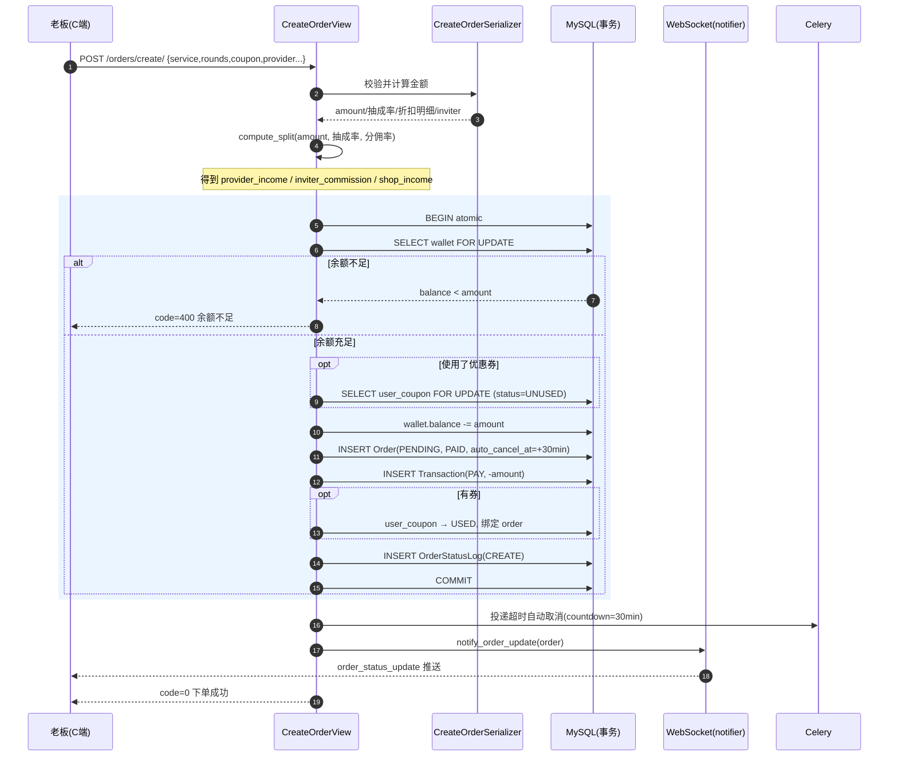
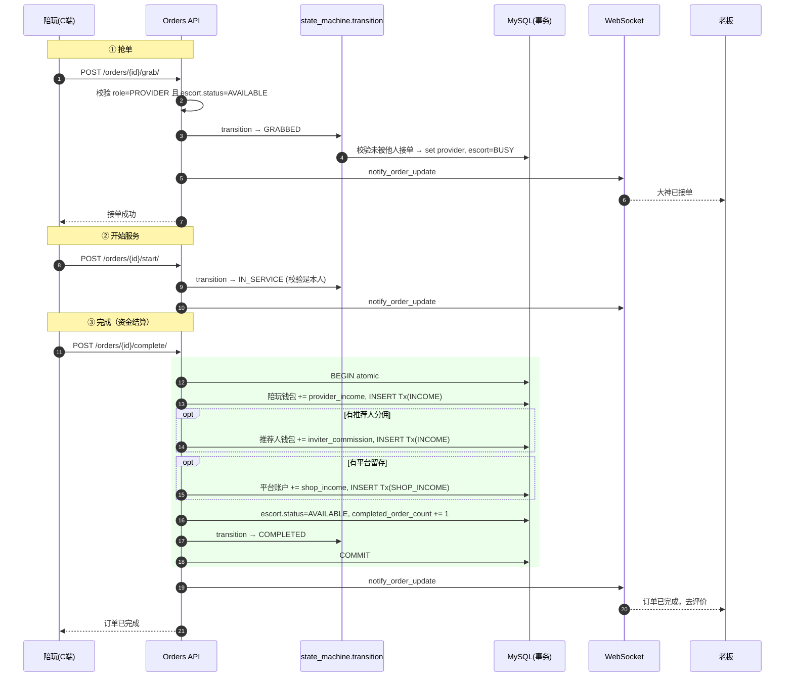
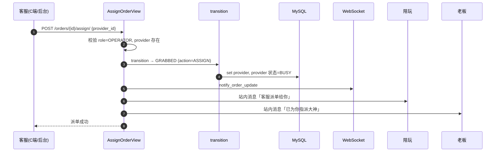
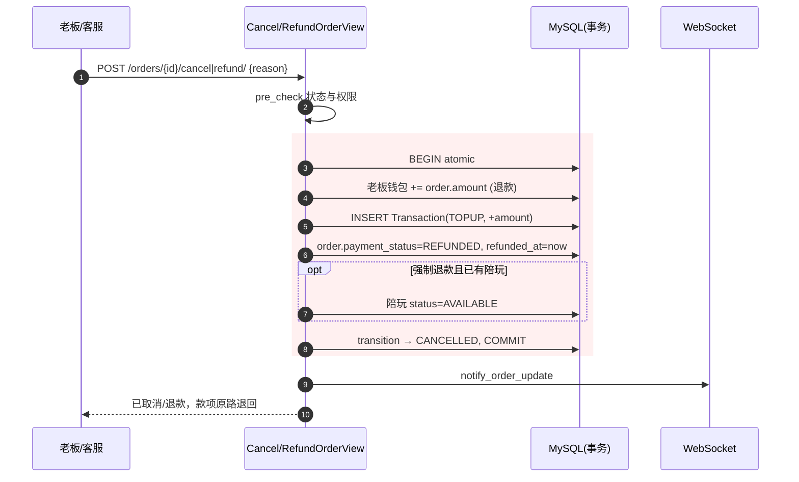
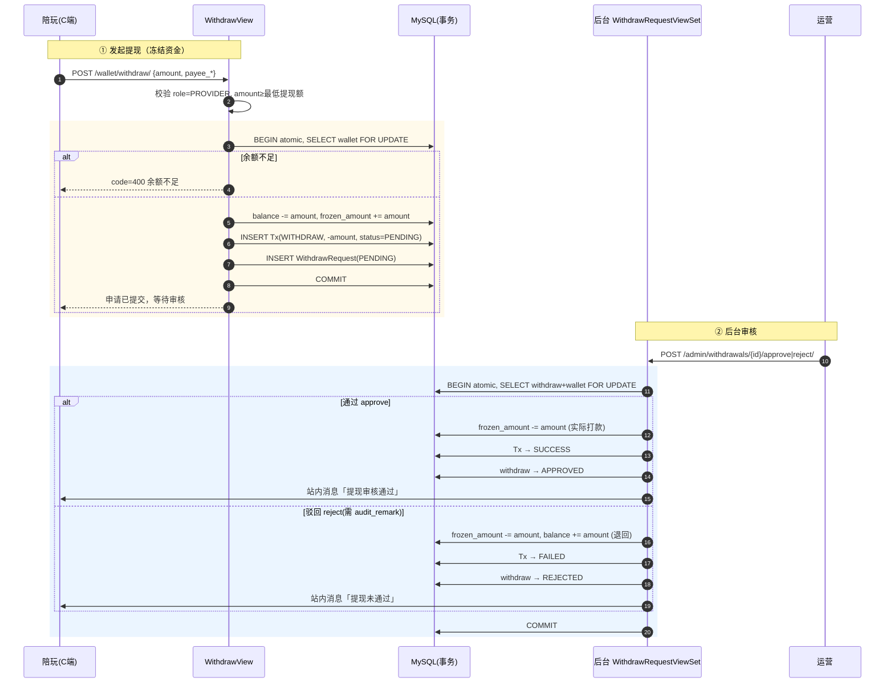
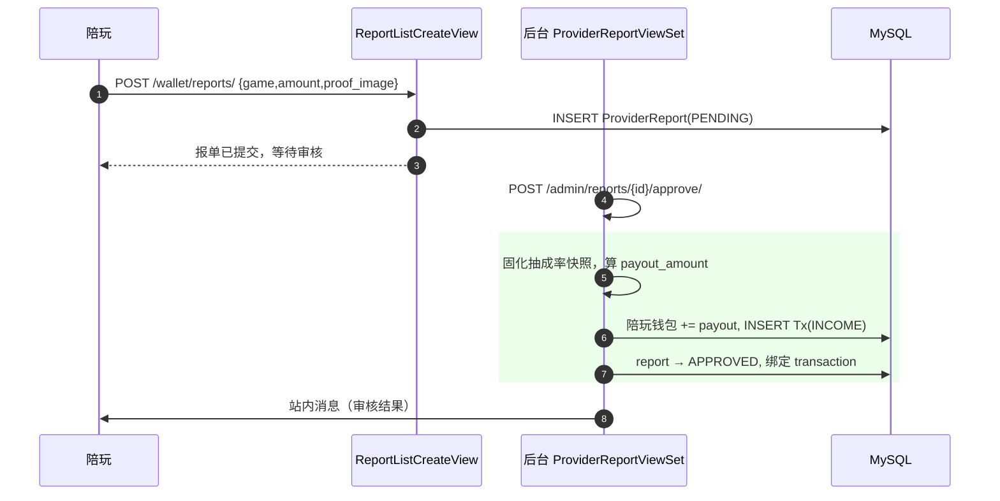
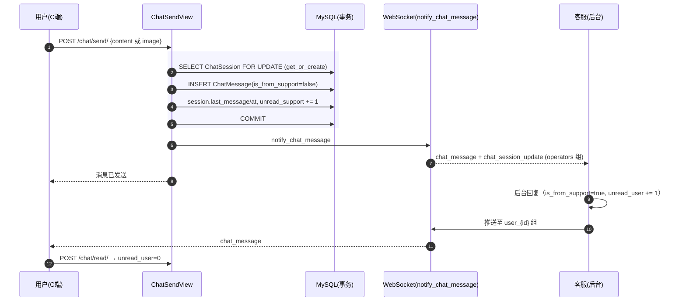
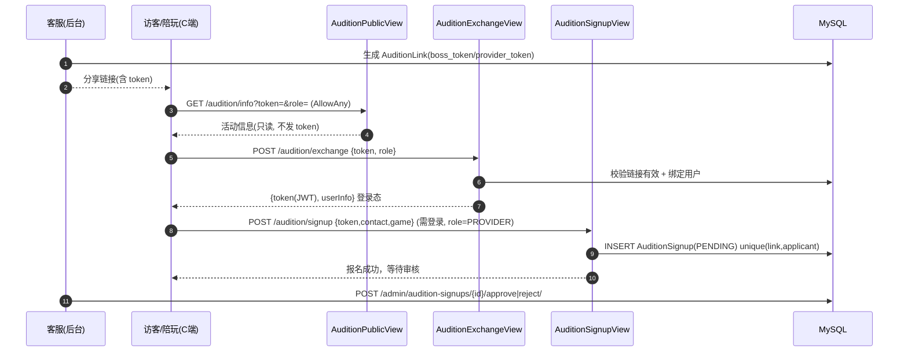
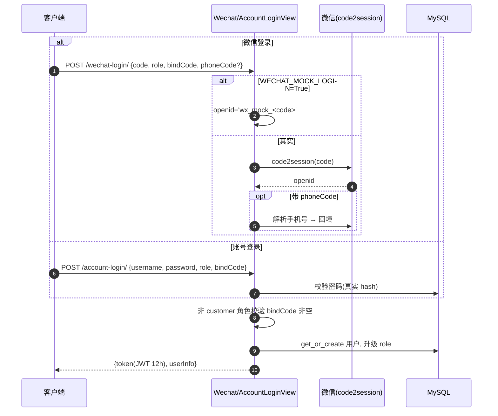

# 兴安电竞（XA）· 核心流程时序图

> 配套文档：[PRD.md](./PRD.md) · [ER.md](./ER.md)　│　最后更新：2026-06-30
>
> 本文用 Mermaid `sequenceDiagram` 描述关键业务链路的端到端调用顺序，含资金动作与 WebSocket 推送。金额单位均为「分」。

---

## 1. 老板下单支付（含计价拆账）

> 入口：`POST /api/orders/create/`　│　核心：`CreateOrderView` + `compute_split`

**计价公式**：`amount = 原价(单价×局数) − 老板折扣 − 活动折扣 − 券抵扣`
**拆账**：`provider_income + inviter_commission + shop_income = amount`

---

## 2. 接单 → 服务 → 完成（收益三方入账）

> 抢单 `POST /orders/{id}/grab/`、开始 `start/`、完成 `complete/`

> 拒单（`reject/`）：订单回 `PENDING`、清 provider、`reject_count+1`、陪玩恢复 `AVAILABLE`。

---

## 3. 客服派单（替代陪玩抢单）

> 入口：`POST /api/orders/{id}/assign/`　│　仅 OPERATOR

---

## 4. 订单取消 / 退款（全额退回）

> 老板取消 `cancel/`（仅 PENDING）；客服强制退款 `refund/`（GRABBED/IN_SERVICE）

---

## 5. 陪玩提现申请 → 后台审核

> 申请 `POST /api/wallet/withdraw/`（冻结）→ 后台 `approve/` 或 `reject/`

---

## 6. 陪玩报单 → 后台审核入账

> 报单 `POST /api/wallet/reports/`（待审）→ 后台 `approve/`（按抽成入账）

> 押金缴纳（`POST /api/wallet/deposit/`）：校验应缴差额 → 扣余额、`deposit_paid += amount`、记 `DEPOSIT` 负数流水。

---

## 7. 客服 IM 实时会话

> C 端 `POST /api/chat/send/` + WebSocket 推送；后台工作台对称回复

> 会话模型：每个非客服用户与客服团队共享唯一 `ChatSession`（一对一）。

---

## 8. 招募试音（免登录换发 JWT）

> 客服后台生成链接 → 访客凭 token 换 JWT → 陪玩报名 → 后台审核

---

## 9. 微信 / 账号登录

> `POST /api/users/wechat-login/`（小程序）｜`account-login/`（H5）

---

## 推送与并发要点

| 机制 | 说明 |
|------|------|
| WebSocket 分组 | `user_{id}`（点对点）、`operators`（全体客服）、`providers`（全体陪玩） |
| 推送事件 | `order_status_update`、`chat_message`、`chat_session_update` |
| 并发安全 | 所有资金动作在 `transaction.atomic()` + `select_for_update()` 行锁内完成 |
| 兜底 | 超时取消优先 Celery；不可用时由 management command 兜底 |
| 站内消息 | `_push_message_safe` 包裹，推送失败绝不影响主流程 |
</content>
