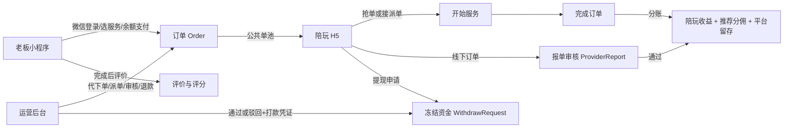
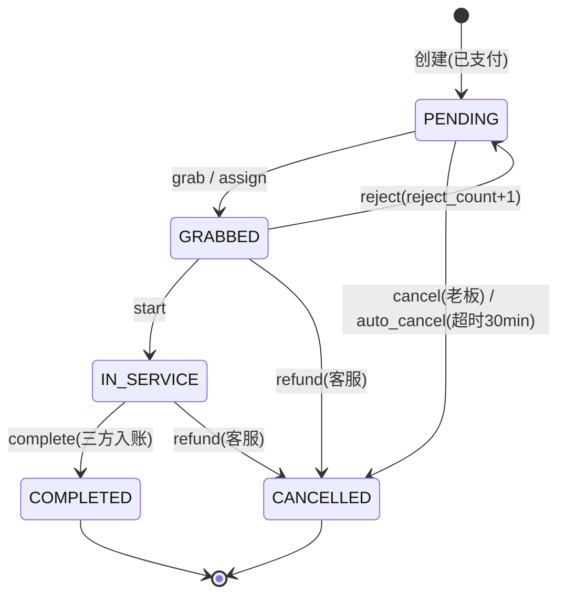
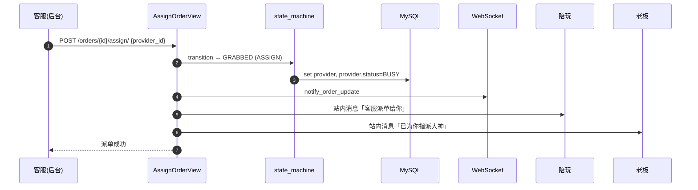

# 兴安电竞（XA）游戏陪玩平台 · 产品开发文档

> **文档性质**：权威统一产品开发文档（单一信息源）
> **版本**：v1.0（整合版）　│　**最后更新**：2026-08-03
> **整合来源**：`PRD.md`、`PRODUCT_DOCUMENTATION.md`、`ARCHITECTURE.md`、`DATABASE_DESIGN.md`、`API.md`、`ER.md`、`Sequence.md`、`DESIGN_SYSTEM.md`、`FRONTEND_STYLE_SYSTEM.md`，以及专项 PRD `PRD_订单管理与陪玩结算.md`。
>
> **说明**：本文件将上述分散文档整合为一份标准、完整的产品开发文档，统一了原有文档间的口径冲突（见 §1.4）。原有分散文档建议在本文件评审通过后归档，避免多份文档 diverge。

---

## 0. 修订记录

| 版本 | 日期 | 说明 |
|------|------|------|
| v1.0（整合版） | 2026-08-03 | 合并 9 份 docs 为单一产品开发文档；统一金额口径为「分」；明确老板端仅微信小程序、不支持 H5；深化订单管理与陪玩报单/提现结算主线。 |

---

## 1. 产品概述

### 1.1 产品定位
兴安电竞（XA）是一套面向**游戏陪玩俱乐部**的单仓多端 SaaS 点单与运营系统，对标耀驰云途智管系统。它将「老板（下单方）下单 → 陪玩（接单方）抢单/履约 → 客服（运营）派单与结算」的完整业务闭环搬到线上，覆盖交易、钱包资金、营销、客服 IM、招募试音、后台运营等全链路。

### 1.2 业务模式
- **老板端（微信小程序）**：平台唯一 C 端交付形态，老板通过微信小程序下单；**未来上架微信小程序，明确不支持 H5**。陪玩端（H5/Web）与运营后台（Web）为相互独立的前端。
- **运营后台（Web）**：俱乐部运营人员管理订单、用户、陪玩、资金、营销与内容。
- **盈利方式**：平台对每笔订单按抽成率抽佣；支持老板分级折扣、促销活动、优惠券等营销手段；陪玩收益经提现审核后结算。

### 1.3 目标用户（角色）

| 角色 | C 端 role | 后端 Role | 职责 |
|------|-----------|-----------|------|
| 老板 | `customer` | `CUSTOMER` | 浏览服务、下单、付款、评价、签到、领券 |
| 陪玩（大神/打手） | `provider` | `PROVIDER` | 接单/拒单、履约、报单、提现、缴押金、维护资料与档期 |
| 客服（运营） | `support` | `OPERATOR` | 派单、代建单、IM 接待、试音招募、审核报单/提现 |
| 平台管理员 | — | `ADMIN` | 后台全功能（RBAC 权限点控制） |
| 平台系统账户 | — | `__platform__`（不可登录） | 归集订单平台留存收入 `shop_income` |

### 1.4 术语与口径（已统一）
- **金额单位**：服务端一律以「分」为内部单位（整数，禁止浮点）。`10 分 = 1 兴安币`，`10 兴安币 = 1 元`；展示层除以 100 得元。签到门槛 188 元/388 元即 1,880/3,880 兴安币。
  > ⚠️ 旧 `README.md` 以"兴安币"为对外存储单位、`PRD.md` 以"分"为内部单位，二者换算一致（1 兴安币 = 10 分）。本文统一以**分**为唯一存储口径。
- **报单（ProviderReport）**：登记"**平台外已完成订单**"的收益申报，**不是**标准订单补录。审核通过后按抽成率把实得计入陪玩钱包。
- **提现（WithdrawRequest）**：陪玩把钱包可用余额提现到微信/支付宝/银行卡，走"冻结 → 审核 → 打款/驳回"两阶段。
- **双陪（Dual-provider）**：一个订单由两名陪玩共同履约，后台代建/派单，分开结算。
- **通行证（Pass）**：陪玩按日购买的抢单优先级凭证，决定公共订单进入个人单池的延迟时间。

### 1.5 全局业务总览



---

## 2. 系统架构

### 2.1 总体结构
单仓多端（monorepo），四个运行单元 + 共用 MySQL/Redis：

| 单元 | 目录 | 技术 | 形态 |
|------|------|------|------|
| 老板端 | `apps/boss-miniapp/` | Taro 4 + React 18 + TS | **微信小程序（不支持 H5）** |
| 陪玩端 | `apps/provider-miniapp/` | Taro 4 + React 18 + TS | H5 / Web |
| 管理端 | `apps/admin-web/` | Vue 3 + Vite 5 + Element Plus | Web |
| 服务端 | `services/backend/` | Django + DRF + Channels + Celery | 统一 API / WebSocket / 异步任务 |

### 2.2 技术栈
| 层 | 技术 |
|----|------|
| 后端 | Django 6 · DRF 3.15 · SimpleJWT · Channels 4 + channels-redis · Daphne(ASGI) · Celery 5 · PyMySQL · Pillow |
| 数据/中间件 | MySQL 8.0（库 `xa_db`）· Redis 6（Channel Layer / Celery broker） |
| 老板/陪玩端 | Taro 4.1.9 · React 18 · TypeScript · Sass · Zustand · dayjs |
| 管理端 | Vue 3.5 · Vite 5 · Element Plus 2.8 · Pinia · Vue Router 4 · ECharts 6 · Axios |

### 2.3 接口与通信约定
- **REST 前缀**：C 端业务接口 `/api/<module>/`；运营后台接口 `/api/admin/`。
- **统一响应体**：`{ code, msg, data }`，`code=0` 成功，业务错误 `code=400/403` 等。
- **鉴权**：JWT Bearer Token，Access 有效期 12 小时、Refresh 7 天。
- **实时通信**：WebSocket `ws://<host>/api/ws/orders/?token=<JWT>`，按 `user_{id}` / `operators` / `providers` 分组推送，事件含 `order_status_update`、`chat_message`、`chat_session_update`。
- **媒体文件**：`/media`。

### 2.4 后端模块边界

| 模块 | 责任 |
|------|------|
| `orders/` | 服务商品、订单、状态机、计价、结算、评价、WS 订单通知 |
| `wallet/` | 钱包、流水、充值、提现、报单、押金、运行时资金配置 |
| `users/` | 登录、身份资料、陪玩资料/档期、签到、成就 |
| `console/` | 后台 RBAC、运营 CRUD、审核、看板 |
| `coupons/`、`promotions/` | 营销权益与下单折扣 |
| `chat/`、`site_messages/`、`support/` | 客服会话、站内消息、客服名片 |
| `announcements/`、`banners/`、`audition/` | 内容运营与试音活动 |

### 2.5 不可跨越的业务规则
- 金额以分存储计算；前端仅格式化展示。
- 订单状态变更必须走 `orders.state_machine.transition`；计价拆账走 `orders.pricing` / `orders.settlement`，下单接口落库快照为准，前端不复刻。
- 钱包变更必须同时创建 `Transaction`，并在 `transaction.atomic()` + `select_for_update()` 行锁内完成。
- `archive/legacy_backup/` 不可被当前应用导入。
- 试音分享链接须配置两个 H5 基址：`AUDITION_BOSS_LINK_BASE_URL`（老板端）、`AUDITION_PROVIDER_LINK_BASE_URL`（陪玩端），不能共用。

### 2.6 部署与运行（概要）
- 后端：`docker compose up -d --build`（MySQL/Redis/迁移/Daphne/Celery Worker/Beat），接口 `http://127.0.0.1:8000/api`。
- 三端：`pnpm --filter xa-boss-miniapp exec taro build --type weapp`（微信小程序）、`provider:build:h5`、`admin:dev`。
- 微信登录需配置 `WECHAT_APPID/SECRET` 且 `WECHAT_MOCK_LOGIN=false`；~~`bindCode`（`PW`=陪玩/`KF`=客服）用于陪玩/客服登录~~ **绑定码机制已废弃：登录不再校验 `bindCode`，陪玩/客服由后台账号密码开户后直接登录**。

---

## 3. 角色功能详述

### 3.1 老板端（微信小程序 · 不支持 H5）
> 交付形态决策：仅微信小程序，不提供 H5；`boss:build:h5` 历史脚本标记弃用；微信快捷登录（`openid`）为唯一登录方式。

- **登录与账号**：微信 `login` 取 code → 换 openid 建号/登录；可授权手机号与昵称；`can_login` 禁登、`can_view` 限制查看。
- **首页**：Banner 轮播、搜索、服务入口、公告、陪玩推荐与榜单、营销入口。
- **服务与陪玩选择**：服务商品（含礼物类标记）、陪玩列表（评分/段位/时价/胜率/认证）；可指定或不指定陪玩。
- **下单与余额支付**：提交服务/局数/指定陪玩/优惠券/游戏资料/备注；服务端计算并同事务扣款、建单、写流水、核销券、写日志。
- **老板订单**：状态列表、取消待接单（退余额）、查看详情、已完成未评价订单评价一次。
- **评价**：综合 1–5 + 技术/态度/沟通三维，文字 + 匿名；陪玩可回复。
- **钱包 / 签到 / 优惠券 / 成就 / 收藏**：余额与流水；月度阶梯签到奖励；领券中心与券包；成就按订单数/消费额实时解锁；服务收藏。
- **消息与客服**：站内消息（系统/订单/客服/活动）；每用户唯一客服会话（文字/图片）；WebSocket 实时推送。

### 3.2 陪玩端（H5 / Web）
- **登录与开户**：账号密码登录（PROVIDER，后台开户后直接登录，~~需 `bindCode`~~ **绑定码机制已废弃**）；WebSocket 实时接单；资料/等级/价格/押金由后台维护。
- **接单工作台**：今日单量/服务中/完成率/累计收益；待接单池（抢/拒）、已接单（拒/开始）、服务中（完成）、已完成（查看）。
- **抢单通行证**：黑/金/银/铜/无卡，日价 50/30/10/2 元 / —，对应公共订单延迟 立即/30s/60s/120s/300s；钱包余额日购，有效期 1 天。
- **履约状态机**：见 §4.1。
- **报单**：见 §4.6。
- **钱包与提现**：见 §4.7。
- **押金**：余额补缴差额（无退押）。见 §4.8。
- **个人资料与档期**：展示资料编辑；每周循环档期（四段制）；认证/等级/时价/押金/奖罚由后台。
- **试音报名**：后台生成老板/陪玩双入口 token 链接，陪玩报名 + 后台审核。

### 3.3 运营后台（Web）
- **工作台/看板**：平台概览（用户/订单/金额 KPI、状态分布、最近订单）；陪玩概览（接单额/量、游戏/礼物与性别、押金/奖罚/钱包、Top10）。
- **派单管理**：筛选、详情与状态日志、代建单、快捷派单、取消/退款/完成。见 §4.3。
- **老板/陪玩管理**：账号、分级、钱包充值/调账；陪玩资料/等级/押金/奖惩/审核入口。
- **商品/营销/内容**：服务商品、促销、优惠券、成就、Banner、公告、客服名片、站内消息（定向/广播）。
- **签到运营**：签到规则配置（日签消费门槛、补签卡门槛与上限、全勤奖名称/Tag）、阶梯礼物 CRUD、用户月度签到进度查询（按年月/是否全勤筛选）。权限点 `checkin:view` / `checkin:edit`；接口 `GET|PUT /api/admin/config/checkin`、`/api/admin/checkin-gifts/`、`/api/admin/checkin-progress/`。详见 §4.10。
- **客服工作台 / 试音审核 / 财务审核**：IM 工作台；报单审核、提现审核；抽成率/最低提现额配置。
- **RBAC**：角色权限点集合，路由守卫 + 按钮级 `auth.hasPerm()` + API 三层校验；超管放行全部。

### 3.4 服务端能力
REST API、JWT 登录、订单实时推送、待接单超时自动取消（Celery，30 分钟）、钱包与结算。接口前缀见 §2.3；不可跨越规则见 §2.5。

---

## 4. 核心业务流程（订单管理 + 陪玩结算主线）

### 4.1 订单状态机



- 每次状态变更写入 `OrderStatusLog`（动作、前后状态、操作人、原因、时间）。
- 并发抢单由事务 + 状态机保证仅一人成功；成功后陪玩 BUSY，完成恢复 AVAILABLE。
- **指定陪玩订单**：扣款后直进 GRABBED 并锁定该陪玩；**未指定陪玩订单**进公共待接池与超时队列。

### 4.2 下单与计价拆账

```
实付 amount = 原价(单价×局数) − 老板折扣 − 活动折扣 − 券抵扣
分账：provider_income + inviter_commission + shop_income = amount
```
- 抽成率优先级：**促销活动 > 陪玩等级 > 商品抽成 > 全局**（默认 `PLATFORM_COMMISSION_RATE=20%`）。
- 折扣型促销与优惠券互斥；券需未用/未过期/满足门槛；余额不足不建单。
- 下单固化全部计价与拆账快照；**完成时**才实际入钱包（`INCOME` / 推荐 `INCOME` / 平台 `SHOP_INCOME`）。

```mermaid
sequenceDiagram
    autonumber
    participant C as 老板(小程序)
    participant API as CreateOrderView
    participant DB as MySQL(事务)
    participant MQ as Celery
    participant WS as WebSocket
    C->>API: POST /orders/create/ {service,rounds,coupon,provider...}
    API->>API: 校验+计算 amount/抽成率/折扣/inviter
    API->>API: compute_split → provider_income/inviter_commission/shop_income
    rect rgb(235,245,255)
    API->>DB: BEGIN; SELECT wallet FOR UPDATE
    alt 余额不足
        API-->>C: code=400 余额不足
    else 余额充足
        API->>DB: wallet.balance -= amount; INSERT Order(PENDING,PAID,auto_cancel_at=+30min)
        API->>DB: INSERT Tx(PAY,-amount); 核销券; INSERT OrderStatusLog(CREATE); COMMIT
    end
    end
    API->>MQ: 投递超时自动取消(30min)
    API->>WS: notify_order_update
    API-->>C: 下单成功
```

### 4.3 抢单 / 派单
- **抢单**：陪玩须 AVAILABLE，服务端事务保证仅一人成功；指定陪玩订单不支持抢单。
- **通行证分级开放**：黑卡即时、金卡 30s、银卡 60s、铜卡 120s、无卡 300s；服务端同时校验列表可见与抢单动作，不能绕过。
- **派单**：客服 `POST /orders/{id}/assign/ {provider_id}`，订单转 GRABBED，向陪玩与老板各推站内消息。



### 4.4 履约与完成（含双陪结算）
- **状态流转**：GRABBED → IN_SERVICE（start）→ COMPLETED（complete）。拒单回 PENDING、清 provider、`reject_count+1`、陪玩恢复 AVAILABLE。
- **双陪**：后台代建/派单；每名打手以订单实付为结算基数，分别按各自百分比/固定抽成算实得；订单级推荐分佣与平台留存只入一份。
  > ⚠️ **开放问题**：当前规则两名打手实得之和**可能高于订单实付**。是否改为"平均分配实付为基数后再各自抽成"（代码已支持可配置比例），需财务签字确认。

```mermaid
sequenceDiagram
    autonumber
    participant P as 陪玩
    participant API as Orders API
    participant SM as state_machine
    participant DB as MySQL(事务)
    participant WS as WebSocket
    participant C as 老板
    P->>API: POST /orders/{id}/grab/
    API->>SM: transition → GRABBED
    API->>WS: notify_order_update
    P->>API: POST /orders/{id}/start/
    API->>SM: transition → IN_SERVICE
    P->>API: POST /orders/{id}/complete/
    rect rgb(235,255,235)
    API->>DB: BEGIN; 陪玩钱包 += provider_income; INSERT Tx(INCOME)
    opt 有推荐人
        API->>DB: 推荐人钱包 += inviter_commission; INSERT Tx(INCOME)
    end
    opt 有平台留存
        API->>DB: 平台账户 += shop_income; INSERT Tx(SHOP_INCOME)
    end
    API->>DB: escort.status=AVAILABLE; completed_order_count+=1; transition→COMPLETED; COMMIT
    end
    API->>WS: notify_order_update
    API-->>C: 去评价
```

### 4.5 评价、取消与退款
- 评价：仅老板在 COMPLETED 后提交一次，三维评分；匿名；陪玩/后台可回复；后台删除回退评分聚合。
- 取消：老板仅可取消 PENDING，全额退余额。
- 退款：客服 `refund`（GRABBED/IN_SERVICE，原因必填），支付状态转 REFUNDED，退余额并写独立 `REFUND` 流水。

```mermaid
sequenceDiagram
    autonumber
    participant U as 老板/客服
    participant API as Cancel/RefundView
    participant DB as MySQL(事务)
    participant WS as WebSocket
    U->>API: POST /orders/{id}/cancel|refund/ {reason}
    rect rgb(255,240,240)
    API->>DB: BEGIN; 老板钱包 += amount; INSERT Tx(REFUND,+amount)
    API->>DB: payment_status=REFUNDED; transition→CANCELLED; COMMIT
    end
    API->>WS: notify_order_update
    API-->>U: 已取消/退款，原路退回
```

### 4.6 陪玩报单（ProviderReport）
- 陪玩登记平台外已完成订单：游戏名称、实际收款金额、说明，上传**一张**凭证图；状态 PENDING。
- 后台审核通过：固化抽成率，按报单金额扣平台抽成后实得计入钱包（`INCOME`）；驳回不发生资金动作；已审核不可重复审。
- 配置：全局抽成率 `GET/PUT /api/admin/config/commission`。

```mermaid
sequenceDiagram
    autonumber
    participant P as 陪玩
    participant API as ReportListCreateView
    participant A as 后台 ProviderReportViewSet
    participant DB as MySQL
    P->>API: POST /wallet/reports/ {game,amount,proof_image}
    API->>DB: INSERT ProviderReport(PENDING)
    A->>A: POST /admin/reports/{id}/approve/ 固化抽成率→payout
    A->>DB: 陪玩钱包 += payout; INSERT Tx(INCOME); report→APPROVED
    A->>P: 站内消息(审核结果)
```

### 4.7 提现（WithdrawRequest）
- 方式：微信/支付宝/银行卡，需收款账号 + 真实姓名。
- 约束：金额 ≥ `MIN_WITHDRAW_AMOUNT`（默认 10000 分=100 元）且 ≤ 可用余额。
- 申请：`balance-=amount`、`frozen+=amount`，生成 `WITHDRAW/PENDING` 流水 + 提现单。
- 后台通过：减冻结、流水 SUCCESS（进入人工打款，须填打款流水号/凭证编号/打款时间，见 §9 风险 WD-1）；驳回：减冻结并退回余额、流水 FAILED（原因必填）。
- 数据库约束：提现额 > 0；税率 0..100；税额 ≤ 申请额；`actual_amount = amount - tax_amount` 由模型与约束保证。

```mermaid
sequenceDiagram
    autonumber
    participant P as 陪玩
    participant W as WithdrawView
    participant DB as MySQL(事务)
    participant A as 后台 WithdrawRequestViewSet
    participant Op as 运营
    P->>W: POST /wallet/withdraw/ {amount, payee_*}
    W->>W: 校验 PROVIDER, amount≥门槛
    rect rgb(255,250,235)
    W->>DB: BEGIN; balance-=amount; frozen+=amount; INSERT Tx(WITHDRAW,PENDING); INSERT WithdrawRequest(PENDING); COMMIT
    end
    Op->>A: POST /admin/withdrawals/{id}/approve|reject/
    rect rgb(235,245,255)
    alt 通过(须填打款凭证)
        A->>DB: frozen-=amount; Tx→SUCCESS; withdraw→APPROVED
    else 驳回(须 audit_remark)
        A->>DB: frozen-=amount; balance+=amount; Tx→FAILED; withdraw→REJECTED
    end
    end
    A->>P: 站内消息(审核结果)
```

### 4.8 押金（Deposit）
后台配置应缴/已缴；陪玩余额补缴差额（生成 `DEPOSIT` 流水）。⚠️ 当前**不支持退押**（缺口 DP-1）。

### 4.9 钱包与资金流水（Wallet / Transaction）
- Wallet：余额/冻结/累计充值/累计赠送，均不可为负。
- Transaction：基础 9 类（`TOPUP/GIFT/PAY/INCOME/WITHDRAW/REWARD/PENALTY/DEPOSIT/SHOP_INCOME`），有符号整数，记 `balance_before/after`，不可缺失；退款使用独立的 `REFUND` 类型（见 §4.5，已优化）。
- 并发安全：资金变更在 `transaction.atomic()` + `select_for_update()` 内完成。
- 充值：客服后台为老板充值，可附赠送额（实充 `TOPUP`、赠送 `GIFT`），保存第三方流水号/凭证图/备注/操作人。

### 4.10 签到 / 优惠券 / 成就 / 收藏

**签到（消费型签到，非纯打卡）**——规则全部由后台单例配置 `CheckinRuleConfig`（pk=1）驱动：

| 机制 | 规则 | 配置字段（默认值） |
|------|------|--------------------|
| 日签门槛 | 当日消费额达到门槛才允许签到；未达标返回还差多少 | `daily_spend_required`（18800 分 = 188 元） |
| 阶梯奖励 | 按「当月累计第 N 天」发放礼物 + 余额奖励，入钱包 | `CheckinGift`（`checkin_day` 1–31 唯一、`reward_amount`、`is_active`） |
| 补签卡 | 当日消费达更高门槛额外发 1 张补签卡；每月上限 3 张；补签消耗 1 张且不再校验当日消费 | `makeup_card_spend_required`（38800 分 = 388 元）、`max_makeup_cards`（3） |
| 全勤奖 | 当月天数全部签满 → 自动发放专属 Tag，并推送站内消息 | `full_attendance_reward_name`（KOOK专属Tag）/`_desc`/`_tag_code` |
| 月度重置 | `CheckinMonthProgress` 按 `(user, year, month)` 唯一，天然按自然月隔离，无需定时清理 | — |

- 数据模型：`CheckinRuleConfig`（全局规则单例）、`CheckinGift`（阶梯礼物）、`CheckinRecord`（逐日签到，标记 `is_makeup`）、`CheckinMonthProgress`（补签卡库存 + 全勤状态）。
- 后台入口见 §3.3「签到运营」。
- 优惠券：满减/无门槛，有效期、库存、每人每券限领一次；券包按未用/已用/已过期展示。
- 成就：按已完成订单数或累计消费额实时解锁。
- 收藏：服务商品收藏/取消。

### 4.11 客服 IM / 站内消息
- 每非客服用户与客服团队共享唯一 `ChatSession`（一对一）；文字/图片；WebSocket 实时到达。
- 站内消息分系统/订单/客服/活动，支持单条已读、全部已读、未读数；后台可定向/广播。

### 4.12 招募试音
客服后台生成 `AuditionLink`（boss/provider 双 token 免登录入口）→ 访客凭 token 换 JWT → 陪玩报名 → 后台审核。同一用户对同一活动仅报名一次。

---

## 5. 数据模型

### 5.1 实体关系全景

```mermaid
erDiagram
    CustomUser ||--o| EscortProfile : "1:1 陪玩资料"
    CustomUser ||--o| Wallet : "1:1 钱包"
    CustomUser ||--o| ChatSession : "1:1 客服会话"
    CustomUser ||--o| AdminMembership : "1:1 管理员身份"
    CustomUser ||--o{ Order : "下单(customer) / 接单(provider)"
    CustomUser ||--o{ CheckinRecord : "签到"
    CustomUser ||--o{ EscortSchedule : "档期"
    CustomUser ||--o{ UserCoupon : "领券"
    CustomUser ||--o{ ServiceFavorite : "收藏"
    CustomUser ||--o{ WithdrawRequest : "提现"
    CustomUser ||--o{ ProviderReport : "报单"
    CustomUser ||--o{ RechargeRecord : "充值"
    CustomUser ||--o{ DisposeRecord : "奖罚"
    CustomUser ||--o{ Message : "站内消息"
    CustomUser }o--o| BossType : "老板分级"
    CustomUser }o--o| CustomUser : "推荐人(inviter)"
    BossType ||--o{ CustomUser : ""
    EscortLevel ||--o{ EscortProfile : "等级"
    ServiceItem ||--o{ Order : "服务"
    ServiceItem ||--o{ ServiceFavorite : ""
    ServiceItem }o--o{ Promotion : "活动适用商品"
    Order ||--o| Evaluation : "1:1 评价"
    Order ||--o{ OrderStatusLog : "状态日志"
    Order ||--o{ Transaction : "关联流水"
    Wallet ||--o{ Transaction : "流水"
    Transaction ||--o| WithdrawRequest : "提现流水"
    Transaction ||--o| ProviderReport : "报单入账流水"
    Coupon ||--o{ UserCoupon : "券模板"
    AuditionLink ||--o{ AuditionSignup : "试音报名"
    ChatSession ||--o{ ChatMessage : "会话消息"
    AdminRole ||--o{ AdminMembership : "角色成员"
```



### 5.2 核心数据对象（订单与资金域 · 本文主线）

**Order / OrderProvider / OrderStatusLog**
| 字段 | 含义 |
|------|------|
| order_no | 业务单号（唯一） |
| amount / original_amount | 实付 / 原价（分） |
| boss_discount / promo_discount / coupon_discount | 老板/活动/券折扣额（分） |
| commission_rate | 抽成率快照 % |
| provider_income / inviter_commission / shop_income | 陪玩实得/推荐分佣/平台留存（分，快照） |
| game_region / game_nickname / game_uid / remark | 游戏资料与备注 |
| status | PENDING/GRABBED/IN_SERVICE/COMPLETED/CANCELLED |
| payment_status | UNPAID/PAID/REFUNDED |
| auto_cancel_at / reject_count / *时间节点 | 超时、拒单数、各态时间 |
| OrderProvider | 单/双打手独立结算明细快照 |

**Wallet / Transaction**
| 字段 | 含义 |
|------|------|
| balance / frozen_amount / total_recharge / total_gift | 余额/冻结/累计实充/累计赠送（分） |
| Transaction.tx_type | TOPUP/GIFT/PAY/INCOME/WITHDRAW/REWARD/PENALTY/DEPOSIT/SHOP_INCOME |
| balance_before/after | 变更前后余额（不可缺失） |

**ProviderReport（报单）**
| 字段 | 含义 |
|------|------|
| game_name / description / amount / proof_image | 游戏/说明/报单额(分)/凭证 |
| status | PENDING/APPROVED/REJECTED |
| commission_rate / payout_amount | 抽成率快照 / 陪玩实得(分) |
| auditor_id / transaction_id / audited_at | 审核人/入账流水/审核时间 |

**WithdrawRequest（提现）**
| 字段 | 含义 |
|------|------|
| amount / payee_method(WECHAT/ALIPAY/BANK) / payee_account / payee_name | 提现额(分)/方式/账号/实名 |
| status | PENDING/APPROVED/REJECTED |
| tax_amount / actual_amount | 税额 / 实到账（actual=amount−tax，约束保证） |
| auditor_id / transaction_id / audited_at / 打款凭证字段 | 审核与打款追溯 |

> 其余域（users / marketing / chat / audition / console）的完整 ER 图与字段见原 `docs/ER.md`；关系要点：CustomUser↔EscortProfile 一对一、Order↔Evaluation 一对一、Transaction 关联各资金动作、RBAC=角色持权限点+用户绑角色。

---

## 6. 接口规范

### 6.1 通用约定
- 响应体 `{ code, msg, data }`；JWT Bearer，Access 12h / Refresh 7d。
- WebSocket 分组：`user_{id}`、`operators`、`providers`；事件 `order_status_update` / `chat_message` / `chat_session_update`。
- 后台接口 `/api/admin/`，由 DRF Router 提供 27 个资源集 + `auth/*`、`dashboard/*`、`config/*`、`permissions` 等。

### 6.2 C 端 API 一览

| 模块 | 端点（前缀 `/api/`） | 说明 |
|------|----------------------|------|
| 登录 | `users/wechat-login/`、`users/account-login/` | 微信/账号密码登录（绑定码机制已废弃） |
| 用户 | `users/me/`、`users/achievements/`、`users/checkin/` | 资料/成就/签到 |
| 陪玩 | `users/escorts/`、`users/escorts/me/`、`users/escorts/status/`、`users/escorts/schedule/`、`users/provider-stats/` | 列表/资料/状态/档期/统计 |
| 服务 | `orders/services/`、`orders/services/{id}/`、`orders/services/{id}/evaluations/` | 服务列表/详情/评价 |
| 收藏/榜单 | `orders/favorites/`、`orders/favorites/toggle/`、`orders/rankings/` | 收藏与排行 |
| 订单 | `orders/create/`、`orders/orders/`、`orders/orders/{id}/{grab,start,complete,cancel,reject,refund,assign}/`、`orders/stats/` | 下单与流转 |
| 评价 | `orders/evaluate/`、`orders/evaluations/mine/`、`orders/evaluations/{id}/reply/` | 评价与回复 |
| 钱包 | `wallet/info/`、`wallet/topup/`、`wallet/income/`、`wallet/withdraw/`、`wallet/transactions/`、`wallet/reports/`、`wallet/deposit/` | 钱包/提现/报单/押金 |
| 优惠券 | `coupons/`、`coupons/mine/`、`coupons/{id}/claim/` | 领券中心 |
| 内容 | `banners/`、`announcements/`、`announcements/{id}/`、`messages/`、`messages/unread-count/`、`messages/read-all/` | Banner/公告/消息 |
| 客服 | `chat/session/`、`chat/send/`、`chat/read/`、`support/contact-card/` | IM 与名片 |
| 试音 | `audition/info`、`audition/exchange`、`audition/signup`、`audition/my-signups` | 试音招募 |

### 6.3 关键对象字段要点
- **OrderSerializer**：`id, order_no, status, payment_status, amount, game_rounds, game_region, game_nickname, game_uid, remark, service{…}, customer{id,nickname,phone}, provider{id,nickname}|null, is_evaluated, grabbed_at, in_service_at, completed_at, cancelled_at, refunded_at, cancel_reason, auto_cancel_at, reject_count, created_at, updated_at`。
- **WithdrawRequest**：`id, amount, payee_method, payee_method_display, payee_account, payee_name, status, status_display, remark, audit_remark, created_at, audited_at`。
- **ProviderReport**：`id, game_name, description, amount, proof_image_url, status, status_display, commission_rate, payout_amount, remark, audit_remark, created_at, audited_at`。

### 6.4 后台权限点示例
`order:view / order:dispatch / order:refund / order:cancel / report:view / report:audit / withdraw:view / withdraw:audit`。路由守卫校验 `meta.perm`，页面内 `auth.hasPerm()` 控按钮，API 再校验动作权限。

---

## 7. 视觉与样式规范

### 7.1 设计原则与色彩 Token
- 品牌蓝 `#007AFF`；成功 `#34C759`、警告 `#FF9500`、错误 `#FF3B30`。
- 页面背景 `#F2F2F7`、容器白、主文本 `#1D1D1F`。
- 移动端优先 Taro 原生组件；后台优先 Element Plus 语义 token；卡片靠层级/细边框/轻阴影；触控区 ≥ 44px/88rpx；动效只表达状态。

### 7.2 移动端基础 Token
| 类型 | 取值 |
|------|------|
| 页面边距 | 32rpx |
| 小/中/大间距 | 16 / 24 / 32rpx |
| 输入框/卡片/弹层圆角 | 12–16 / 24 / 32rpx |
| 正文/辅助/标题 | 28 / 22–24 / 32–40rpx（600–700 字重） |

### 7.3 样式系统分层与约束
- 单一事实来源：`packages/design-system/src/_theme.scss`（品牌/语义色、暗色、动效）、`_miniapp.scss`（小程序间距/字号/圆角/阴影）。业务代码仅用语义名（`--xa-color-primary` 等），禁止硬编码品牌色。
- 分层：Primitive → Semantic → Component → Page；页面只负责布局组合。
- 单位：小程序/服务者端 `rpx`，后台 `px`（颜色/字体/动效共用 `--xa-*`）；`PX` 仅 H5 桌面适配。
- 控件须覆盖 normal/pressed/disabled/focus；文本满足 WCAG AA；错误/成功不只靠颜色表达；`prefers-reduced-motion` 下关闭非必要动画。

---

## 8. 非功能性需求
- **实时性**：订单状态与客服消息经 WebSocket 秒级推送；断线后 REST 拉取兜底。
- **并发安全**：钱包 `select_for_update` + 事务，防超扣/重复入账/重复抢单。
- **数据一致性**：资金写操作在 `transaction.atomic()` 内；分账守恒在事务结算完成时校验。
- **可配置**：抽成率、最低提现额、税率等运行参数后台动态调整（`SystemConfig`）。
- **合规**：真实姓名/收款账号/打款凭证属敏感个人信息，按个人信息保护法加密存储与最小可见（仅财务角色可视全账号，其余脱敏）。
- **可观测**：订单状态日志、资金流水、报单/提现审核动作全程留痕，支持审计与对账。

---

## 9. 风险与开放问题

| 优先级 | 风险/缺口 | 影响 | 处置 |
|--------|-----------|------|------|
| P0 | 老板充值无微信支付闭环，依赖人工入账 | 无法纯自助交易闭环 | 独立专项，需决策是否一期接微信支付 |
| P0 | 提现无真实打款渠道，仅人工+凭证字段（WD-1） | 财务工作量大、易漏打 | 固化打款凭证强制字段；渠道 API 后续专项 |
| P1 | 双陪结算基数可能使实得 > 实付 | 财务模型失真 | 提交财务签字确认 |
| P1 | 订单无预约时间/时长（ORD-1/2） | 难做排班/冲突/提醒 | 新增预约时间、预计时长、档期冲突检测 |
| P2 | 报单不关联老板/商品/时长（RPT-1） | 经营分析弱 | 增业务归属字段 |
| P2 | 押金仅缴不退（DP-1） | 陪玩退出无闭环 | 增退押申请/审核/打款 |
| P2 | 自动取消依赖 Celery/Redis（ORD-3） | 运维异常致长期待接单 | 补偿扫描 + 超时告警 |
| P2 | 封禁仅开关无原因/期限/审计（ORD-4） | 风控追溯不足 | 增封禁记录与操作日志 |
| 口径 | README"兴安币" vs PRD"分" | 文档歧义 | 已统一为「分」存储、展示换算元 |

---

## 10. 验收主链路
1. 后台建老板等级/陪玩等级/游戏服务分类/服务商品/陪玩账号。
2. 后台给老板充值；老板微信登录（小程序）并维护游戏资料。
3. 老板选商品+陪玩+局数下单，校验折扣/活动/券互斥与余额扣款；验证快照固化。
4. 陪玩抢单与后台派单均成功；并发仅一人抢单；指定陪玩订单直进 GRABBED。
5. 陪玩开始→完成；核对陪玩/推荐人/平台钱包与全部流水（分账守恒）。
6. 双陪后台代建/完成，核对两名打手分别入账与平台留存唯一。
7. 老板评价，陪玩回复；核对评分聚合。
8. 待接单取消、超时取消、后台退款，核对券/余额/REFUND 流水。
9. 陪玩提交报单（含业务归属），后台通过/驳回并核资金。
10. 陪玩申请提现（三种方式），后台**填打款凭证**通过/驳回，核对可用/冻结与 `actual_amount`。
11. 试音链接过期/停用、重复报名与审核。
12. 不同后台角色验证菜单/按钮/API 三层 RBAC（含 `order:*` / `report:audit` / `withdraw:audit`）。
13. 断 WebSocket 后 REST 数据仍正确，恢复后实时刷新。

---

## 11. 附录

### 11.1 文档对照与退役建议
本文件整合以下文档，评审通过后建议将源文件移至归档以避免多份文档不一致：
`PRD.md`、`PRODUCT_DOCUMENTATION.md`、`ARCHITECTURE.md`、`DATABASE_DESIGN.md`、`API.md`、`ER.md`、`Sequence.md`、`DESIGN_SYSTEM.md`、`FRONTEND_STYLE_SYSTEM.md`、`PRD_订单管理与陪玩结算.md`。

### 11.2 术语表
- **兴安币/分/元**：10 分 = 1 兴安币 = 0.1 元。
- **报单**：平台外订单收益申报（非标准订单补录）。
- **双陪**：一个订单两名陪玩共同履约，后台代建。
- **通行证**：陪玩按日购买的抢单优先级凭证。
- **CUSTOMER/PROVIDER/OPERATOR/ADMIN**：老板/陪玩/客服/管理员对应的后端角色。

> 详细 ER 图、完整时序图（IM/试音/登录）、后台 27 资源集字段与迁移流程，仍以原 `docs/ER.md`、`docs/Sequence.md`、`docs/API.md`、`docs/DATABASE_DESIGN.md` 为权威细节来源，直至本文件评审通过并退役源文档。
